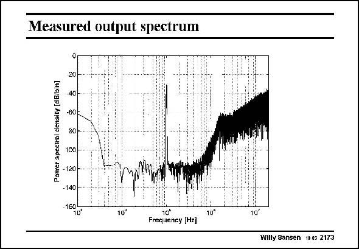

# SANSEN-2173 · Measured output spectrum

章节：21 低功耗 ΣΔ 模数转换器  
PDF 页：663；书本页：674；幻灯片编号：2173  
状态：unreviewed



## 对应教材讲解

### PDF 663 · 书本 674

The output spectrum shows the response of a 100 kHz sinusoidal input signal. A peak SNR of 86 dB has been obtained. The maximum signal bandwidth is 500 kHz.

## 公式／性能结论候选摘录

以下为规则截取的原文，尚未逐项判读。

- PDF 663: The maximum signal bandwidth is 500 kHz.

## 曲线结论候选摘录

以下为规则截取的原文，尚未逐项判读。

- PDF 663: A peak SNR of 86 dB has been obtained.

## 原文条件与近似候选摘录

以下为规则截取的原文，尚未逐项判读。

（未由规则找到；不代表原页没有此类内容。）

## 幻灯片 OCR（未校正）

```text
Measured output spectrum
Power spectral density [dB/bin]
20
40
-60
80
100
-120 -.
-140
-160
1D
10*
10'
Frequency [Hz]
10€
10°
Willy Sansen 10.05 2173
```

数学上下标、分数及正负号以原图为准。电路图已保留；未核对的连接不输出成可仿真 netlist。
