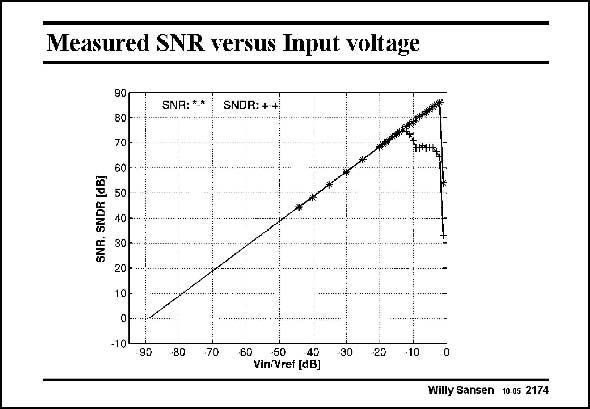

# SANSEN-2174 · Measured SNR versus Input voltage

章节：21 低功耗 ΣΔ 模数转换器  
PDF 页：663；书本页：674；幻灯片编号：2174  
状态：unreviewed



## 对应教材讲解

### PDF 663 · 书本 674

The maximum SNR is 86 dB but the maximum SNDR is reduced to about 75 dB. This is a result of the distortion generated in the feedforward switch, which has to handle the full input signal swing. This must be improved further.

## 公式／性能结论候选摘录

以下为规则截取的原文，尚未逐项判读。

（未由规则找到；不代表原页没有此类内容。）

## 曲线结论候选摘录

以下为规则截取的原文，尚未逐项判读。

（未由规则找到；不代表原页没有此类内容。）

## 原文条件与近似候选摘录

以下为规则截取的原文，尚未逐项判读。

（未由规则找到；不代表原页没有此类内容。）

## 幻灯片 OCR（未校正）

```text
Measured SNR versus Input voltage
SNR. SNDR [dB]
90
80
70
60
50
10-...
30 -
20-
10-
SNR:**
SNOR: ++
-10
90
80
70
60
50
40
ViniVref [dBJ
30
20
-10
Willy Sansen 10.05 2174
```

数学上下标、分数及正负号以原图为准。电路图已保留；未核对的连接不输出成可仿真 netlist。
