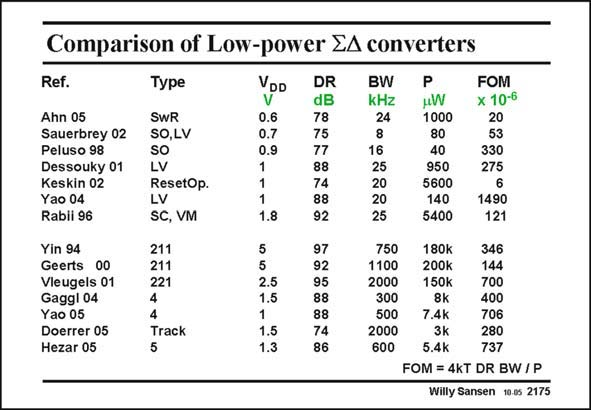

# SANSEN-2175 · Comparison of Low-power EA converters

章节：21 低功耗 ΣΔ 模数转换器  
PDF 页：664；书本页：675；幻灯片编号：2175  
状态：unreviewed



## 对应教材讲解

### PDF 663 · 书本 674

As a conclusion, a table is made up for comparison. A Figure of Merit is used as in Rabii (JSSC June 97, 783–796). Only low-power sigma-delta converters are considered in the top list. After the name the year of publication (in the JSSC or ISSCC) is given. The type mentions which technique is used to arrive at 1 V supply voltage. SwR stands for switched-resistor, SO for switched-Opamp, LV for reduced threshold voltage, VM for voltage multiplier. The supply voltage is listed, followed by the dynamic range, bandwidth and power consumption.

### PDF 664 · 书本 675

This shows that for supply voltages of 1 V and below, Yao04, Peluso98 and Dessouky01 are the best. On the other hand, the lowest supply voltages have been reached by Ahn05 (0.6 V) and Sauerbrey02 (0.7 V). Quite often, this deals with a reduction of the absolute value of the threshold voltage, however. In the second list, a series of high-frequency sigmadelta converters are added. It is clear that only a few of them operate at 1 V supply voltage or less. Moreover, the FOM’s are in general, higher. This illustrates that compromises have to be taken to be able to reach a 1 V supply voltage or less.

## 公式／性能结论候选摘录

以下为规则截取的原文，尚未逐项判读。

- PDF 663: As a conclusion, a table is made up for comparison.
- PDF 663: The supply voltage is listed, followed by the dynamic range, bandwidth and power consumption.

## 曲线结论候选摘录

以下为规则截取的原文，尚未逐项判读。

（未由规则找到；不代表原页没有此类内容。）

## 原文条件与近似候选摘录

以下为规则截取的原文，尚未逐项判读。

（未由规则找到；不代表原页没有此类内容。）

## 幻灯片 OCR（未校正）

```text
Comparison of Low-power EA converters
Ref.
Type
VDD
V
Ahn 05
Sauerbrey 02
Peluso 98
Dessouky 01
Kaskino2
Rabii 96
SwR
SO,LV
SO
LV
ResetOp.
LV
SC, VM
211
211
221
0.6
0.7
0.9
r--
1.8
Yin 94
Geerts 00
Vieugels 01
Gaggl 04
Yao 05
Doerrer 05
Hezar 05
10 10.
2.5
4
Track
1.5
1.3
DR
dB
78
75
77
88
74
88
92
97
92
95
88
88
74
86
BW
kHz
24
8
16
25
20
20
25
750
1100
2000
300
500
2000
600
P
HW
1000
80
40
950
5600
140
5400
FOM
x 10-6
20
53
330
275
6
1490
121
180k
200k
346
150k
144
700
8K
7.4k
400
3k
706
280
5.4K
737
FOM = 4kT DR BW /P
Willy Sansen 10.05 2175
```

数学上下标、分数及正负号以原图为准。电路图已保留；未核对的连接不输出成可仿真 netlist。
