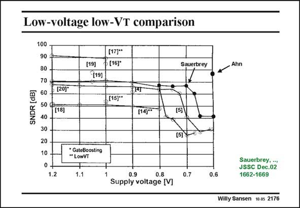

# SANSEN-2176 · Low-voltage low-VT comparison

章节：21 低功耗 ΣΔ 模数转换器  
PDF 页：664；书本页：675；幻灯片编号：2176  
状态：unreviewed



## 对应教材讲解

### PDF 664 · 书本 675

If only the supply voltage itself is taken as a measure for comparison, the graph in this slide results. Again, the lowest supply voltages have been reached by Ahn05 (0.6 V) and Sauerbrey02 (0.7 V). The two techniques used are also indicated, i.e. gate boosting and reduced threshold voltages.

## 公式／性能结论候选摘录

以下为规则截取的原文，尚未逐项判读。

（未由规则找到；不代表原页没有此类内容。）

## 曲线结论候选摘录

以下为规则截取的原文，尚未逐项判读。

（未由规则找到；不代表原页没有此类内容。）

## 原文条件与近似候选摘录

以下为规则截取的原文，尚未逐项判读。

（未由规则找到；不代表原页没有此类内容。）

## 幻灯片 OCR（未校正）

```text
Low-voltage low-VT comparison
100
90 ₽
80 -
70
SNDR
60
(201"
50 ¢
[18]
40 -
30 -
20 -
10
1.2
(17)"
6 (16)*
[19]
(19]
[15)"
GateBoosting
" LowVT
1.1
(14)"'
Sauerbrey
(5)
(5)
0.7
Ahn
0.9
0.8
Supply voltage M]
0.6
Sauerbrey, •,
JSSC Dec.02
1662-1669
Willy Sansen 10.05 2176
```

数学上下标、分数及正负号以原图为准。电路图已保留；未核对的连接不输出成可仿真 netlist。
