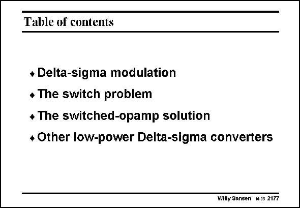

# SANSEN-2177 · Table of contents

章节：21 低功耗 ΣΔ 模数转换器  
PDF 页：665；书本页：676；幻灯片编号：2177  
状态：unreviewed



## 对应教材讲解

### PDF 665 · 书本 676

In this Chapter, an overview is given of the techniques which are available to reduce the supply voltage and the power consumption in sigma-delta converters. The main problem at low supply voltages is the input sampling switch and the increase of the distortion. This can be remedied by the switched-opamp technique and also by a number of clever circuit techniques. They have all been discussed and compared for a generally accepted FOM.

## 公式／性能结论候选摘录

以下为规则截取的原文，尚未逐项判读。

- PDF 665: The main problem at low supply voltages is the input sampling switch and the increase of the distortion.

## 曲线结论候选摘录

以下为规则截取的原文，尚未逐项判读。

（未由规则找到；不代表原页没有此类内容。）

## 原文条件与近似候选摘录

以下为规则截取的原文，尚未逐项判读。

（未由规则找到；不代表原页没有此类内容。）

## 幻灯片 OCR（未校正）

```text
Table of contents
+ Delta-sigma modulation
• The switch problem
• The switched-opamp solution
* Other low-power Delta-sigma converters
Willy Sansen 1005 2177
```

数学上下标、分数及正负号以原图为准。电路图已保留；未核对的连接不输出成可仿真 netlist。
