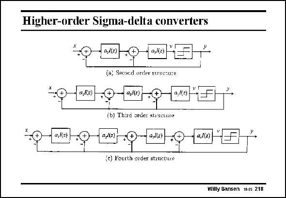

# SANSEN-218 · Higher-order Sigma-delta converters

章节：21 低功耗 ΣΔ 模数转换器  
PDF 页：630；书本页：641；幻灯片编号：218  
状态：unreviewed



## 对应教材讲解

### PDF 630 · 书本 641

Normally, third-and fourthorder filters are used. A firstorder Sigma-Delta is rarely used because it shows patterns in the output spectrum which are hard to remove. Second-order Sigma-delta converters are easy to realize. Since only a secondorder filter is involved, no problems arise with respect to stability. Their noise shaping capability is somewhat limited, however. Third-order and fourthorder converters are used most (see slide). To go higher is difficult because of stability problems. Fourth-order filters in a single feedback loop as shown in this slide, are risky but feasible. It is better to organize them in a Mash or cascaded topology as shown next.

## 公式／性能结论候选摘录

以下为规则截取的原文，尚未逐项判读。

- PDF 630: Their noise shaping capability is somewhat limited, however.

## 曲线结论候选摘录

以下为规则截取的原文，尚未逐项判读。

（未由规则找到；不代表原页没有此类内容。）

## 原文条件与近似候选摘录

以下为规则截取的原文，尚未逐项判读。

（未由规则找到；不代表原页没有此类内容。）

## 幻灯片 OCR（未校正）

```text
Higher-order Sigma-delta converters
0,(2)
a,/(2)
«,Да)
(a) Second order scruesure
a,J(z)
a,((=)
(b) Third order stuuerare
u,K(e)
a,l(z)
2,1(2)
a,](2)
(c) Fourth order structune
Willy Sansen 10.05 218
```

数学上下标、分数及正负号以原图为准。电路图已保留；未核对的连接不输出成可仿真 netlist。
