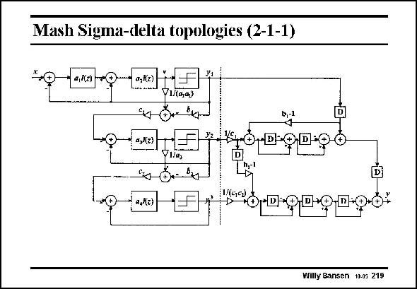

# SANSEN-219 · Mash Sigma-delta topologies (2-1-1)

章节：21 低功耗 ΣΔ 模数转换器  
PDF 页：630；书本页：641；幻灯片编号：219  
状态：unreviewed



## 对应教材讲解

### PDF 630 · 书本 641

A 4th-order Mash (or cascaded) topology has four filter sections for 4th order noise shaping. Only two of them are in a single feedback loop. Stability is easily achieved. It has three outputs however, which are fed to a so-called noise-cancellation circuit. This means that the three outputs must receive the right gain and the right delay so that the noise cancels. Matching will now be an issue. However, many realizations have shown that matching is not really a problem.

## 公式／性能结论候选摘录

以下为规则截取的原文，尚未逐项判读。

- PDF 630: This means that the three outputs must receive the right gain and the right delay so that the noise cancels.

## 曲线结论候选摘录

以下为规则截取的原文，尚未逐项判读。

（未由规则找到；不代表原页没有此类内容。）

## 原文条件与近似候选摘录

以下为规则截取的原文，尚未逐项判读。

（未由规则找到；不代表原页没有此类内容。）

## 幻灯片 OCR（未校正）

```text
Mash Sigma-delta topologies (2-1-1)
a,Kz)
N a/e)
V1/(4,4)
97 0- 14
Vlla,
0.-Bx
- a,Ко)
D
Willy Sansen 10.05 219
```

数学上下标、分数及正负号以原图为准。电路图已保留；未核对的连接不输出成可仿真 netlist。
