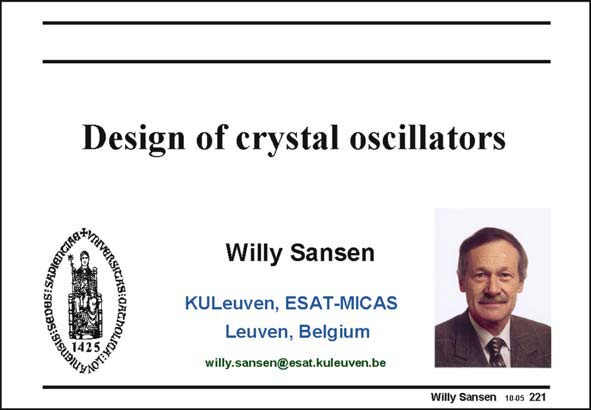

# SANSEN-221 · Slide 221

章节：22 晶体振荡器设计  
PDF 页：666；书本页：677；幻灯片编号：221  
状态：unreviewed



## 对应教材讲解

### PDF 666 · 书本 677

Oscillators are required as references of frequency. All clocks are for (micro)processors but all timing circuits also need a clock. The highest precision is obtained by using a crystal as a reference. Without a lot of effort, 0.1% precision is easily achieved. This is why we start this chapter with crystal oscillators. It will be shown that only one single transistor is required to make a crystal oscillator.

## 公式／性能结论候选摘录

以下为规则截取的原文，尚未逐项判读。

（未由规则找到；不代表原页没有此类内容。）

## 曲线结论候选摘录

以下为规则截取的原文，尚未逐项判读。

（未由规则找到；不代表原页没有此类内容。）

## 原文条件与近似候选摘录

以下为规则截取的原文，尚未逐项判读。

（未由规则找到；不代表原页没有此类内容。）

## 幻灯片 OCR（未校正）

```text
GIG: SEDESI SRDIanG
Design of crystal oscillators
Willy Sansen
KULeuven, ESAT-MICAS
Leuven, Belgium
willy.sansen@esat.kuleuven.be
Willy Sansen 1005 221
```

数学上下标、分数及正负号以原图为准。电路图已保留；未核对的连接不输出成可仿真 netlist。
