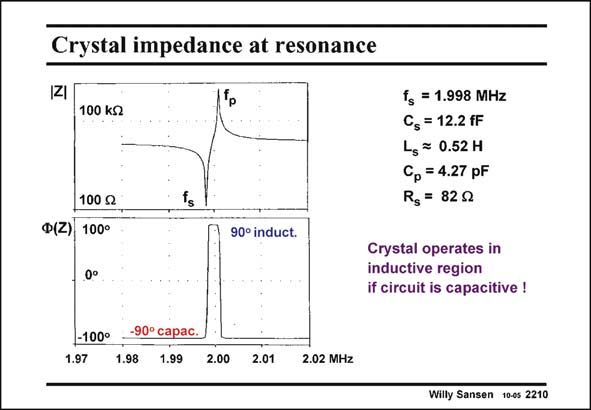

# SANSEN-2210 · Crystal impedance at resonance

章节：22 晶体振荡器设计  
PDF 页：670；书本页：681；幻灯片编号：2210  
状态：unreviewed



## 对应教材讲解

### PDF 670 · 书本 681

Now the resonant frequencies are easily distinguished. The series resonant frequency f is the smaller one. s The values have actually been calculated for the crystal given. The top diagram shows the amplitude, whereas the bottom one shows the phase. The crystal behaves as a capacitor at the left of the series resonant frequency f s and at the right of the parallel resonant frequency f as p explained before.

### PDF 671 · 书本 682

However, between both resonant frequencies the crystal behaves as an inductor. The transitions are very steep because the quality factor is so high. The crystal now behaves as an inductor from the series resonant frequency f to the parallel resonant frequency f . s p We will use this inductor to make an oscillator together with a capacitive amplifier. We want this oscillator to operate as close as possible to the series resonant frequency f as this is the s frequency which is the closest to the internal electromechanical operation of the crystal. Moreover, it is the frequency which is the least dependent on the package and mounting capacitances, which are hard to predict. We will see however, that it is impossible to make an oscillator at the series resonant frequency f . It would take infinite current! We will try to be as close as possible however, depending on s the current that we are allowed to use. This will be the only free design choice!

## 公式／性能结论候选摘录

以下为规则截取的原文，尚未逐项判读。

- PDF 671: Moreover, it is the frequency which is the least dependent on the package and mounting capacitances, which are hard to predict.
- PDF 671: We will try to be as close as possible however, depending on s the current that we are allowed to use.

## 曲线结论候选摘录

以下为规则截取的原文，尚未逐项判读。

- PDF 670: The top diagram shows the amplitude, whereas the bottom one shows the phase.

## 原文条件与近似候选摘录

以下为规则截取的原文，尚未逐项判读。

（未由规则找到；不代表原页没有此类内容。）

## 幻灯片 OCR（未校正）

```text
Crystal impedance at resonance
•*
100 kg
100 g
Ф(Z) 100°
ts
90° induct.
fg = 1.998 MHz
Cs = 12.2 fF
Ls = 0.52 H
Cp = 4.27 pF
Rg = 829
Crystal operates in
inductive region
if circuit is capacitive !
-100°
1.97
-90° capac.
1.98
1.99
2.00
2.01
2.02 MHz
Willy Sansen 10-0s 2210
```

数学上下标、分数及正负号以原图为准。电路图已保留；未核对的连接不输出成可仿真 netlist。
