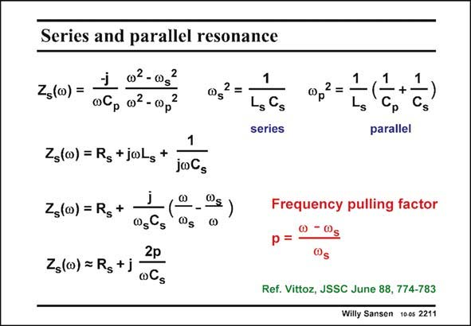

# SANSEN-2211 · Series and parallel resonance

章节：22 晶体振荡器设计  
PDF 页：671；书本页：682；幻灯片编号：2211  
状态：unreviewed



## 对应教材讲解

### PDF 671 · 书本 682

The actual expressions of the series resonant frequency f and the parallel s resonant frequency f are p given in this slide. The series one is as described in this slide. The parallel resonant frequency f on the other p hand is determined by both capacitances in series, as clearly found by inspection of the model. This frequency is always somewhat larger than the series one. If we find that C is about 200 p times larger than C , then s v 2 is approximately 0.5% larger than v 2. Also, v is now about 0.25% larger than v . p s p s The impedance of the series RLC circuit can now be described as given in this slide. We will rewrite this impedance now after introduction of the pulling factor p. This pulling factor p is the dimensionless parameter which says how far the actual operating frequency is from the series resonance frequency f . s Introduction of this factor p and of the frequency f , gives another expression of the impedance s of the series RLC circuit. It says that this impedance is a resistor R in series with an inductor. s This inductor is larger the more we deviate from series resonance. We will use this simple model to find the oscillation condition of the oscillator.

## 公式／性能结论候选摘录

以下为规则截取的原文，尚未逐项判读。

（未由规则找到；不代表原页没有此类内容。）

## 曲线结论候选摘录

以下为规则截取的原文，尚未逐项判读。

（未由规则找到；不代表原页没有此类内容。）

## 原文条件与近似候选摘录

以下为规则截取的原文，尚未逐项判读。

- PDF 671: If we find that C is about 200 p times larger than C , then s v 2 is approximately 0.5% larger than v 2.

## 幻灯片 OCR（未校正）

```text
Series and parallel resonance
j 02-0g
Zs(co)=
06p 02 - 00p
N
@s
1
Zs(00) = Rs+jwLs
+
joGs
Z(w) = Rs
°g)
1
LsGs
series
1
1
+
Cs
parallel
0sCs
2p
Zs(o) = Rg+j
oCs
Frequency pulling factor
Ref. Vittoz, JSSC June 88, 774-783
Willy Sansen 100s 2211
```

数学上下标、分数及正负号以原图为准。电路图已保留；未核对的连接不输出成可仿真 netlist。
