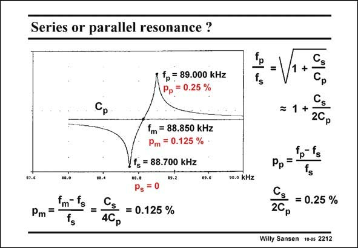

# SANSEN-2212 · Series or parallel resonance ?

章节：22 晶体振荡器设计  
PDF 页：672；书本页：683；幻灯片编号：2212  
状态：unreviewed



## 对应教材讲解

### PDF 671 · 书本 682

The terms series or parallel resonance are often attributed to the circuit configuration. We will see that this is wrong, however! Series and parallel resonance have only to do with the operating point of the oscillator. For zero or very small pulling factor p, the operating point is close to f . In this case, we s clearly have a series oscillator. For a fairly large p, the operating point is close to f . We will p

### PDF 672 · 书本 683

call this a parallel oscillator, although C is still 200 times s more important than C for p the determination of the oscillation frequency. The point in the middle is the crossover value f , m between series and parallel resonance. Since at f we p had a pulling factor p of about 0.25%, the point in the middle must have a pulling factor of about half or 0.125%. We can now conclude that the pulling factor p must be less than about 0.1%, to have a oscillator with good stability and predictability!

## 公式／性能结论候选摘录

以下为规则截取的原文，尚未逐项判读。

（未由规则找到；不代表原页没有此类内容。）

## 曲线结论候选摘录

以下为规则截取的原文，尚未逐项判读。

（未由规则找到；不代表原页没有此类内容。）

## 原文条件与近似候选摘录

以下为规则截取的原文，尚未逐项判读。

（未由规则找到；不代表原页没有此类内容。）

## 幻灯片 OCR（未校正）

```text
Series or parallel resonance ?
S
=
+
p = 89.000 kHz
Pp = 0.25 %
ts
m
Pm
=
Im = 88.850 kHz
Pm = 0.125 %
f = 88.700 kHz
89.2
Ps
= 0
=
= 0.125 %
Cg
=1 +
2Cр
fp- fg
Pp=
90.0 kHz
= 0.25 %
4Cр
2Cр
Willy Sansen 10-0s 2212
```

数学上下标、分数及正负号以原图为准。电路图已保留；未核对的连接不输出成可仿真 netlist。
