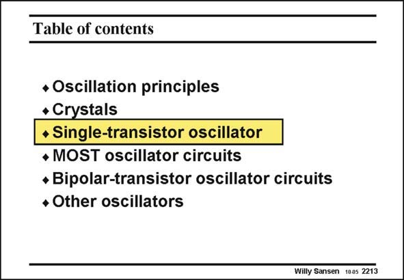

# SANSEN-2213 · Table of contents

章节：22 晶体振荡器设计  
PDF 页：672；书本页：683；幻灯片编号：2213  
状态：unreviewed



## 对应教材讲解

### PDF 672 · 书本 683

Let us now apply the oscillation condition to the combination of a single-transistor amplifier, which is capacitive, and a crystal, which is inductive. The main question is, which circuit components to use to set the pulling factor at sufficiently low values. Clearly one single transistor can provide sufficient gain to carry out this task. For a differential operation we would need two transistors. Obviously if one transistor can do it, many more transistors can also do it. Many transistor oscillators now exist. There is only one single-transistor oscillator, however.

## 公式／性能结论候选摘录

以下为规则截取的原文，尚未逐项判读。

- PDF 672: Clearly one single transistor can provide sufficient gain to carry out this task.

## 曲线结论候选摘录

以下为规则截取的原文，尚未逐项判读。

（未由规则找到；不代表原页没有此类内容。）

## 原文条件与近似候选摘录

以下为规则截取的原文，尚未逐项判读。

（未由规则找到；不代表原页没有此类内容。）

## 幻灯片 OCR（未校正）

```text
Table of contents
• Oscillation principles
+ Crystals
+ Single-transistor oscillator
• MOST oscillator circuits
• Bipolar-transistor oscillator circuits
• Other oscillators
Willy Sansen 1005 2213
```

数学上下标、分数及正负号以原图为准。电路图已保留；未核对的连接不输出成可仿真 netlist。
