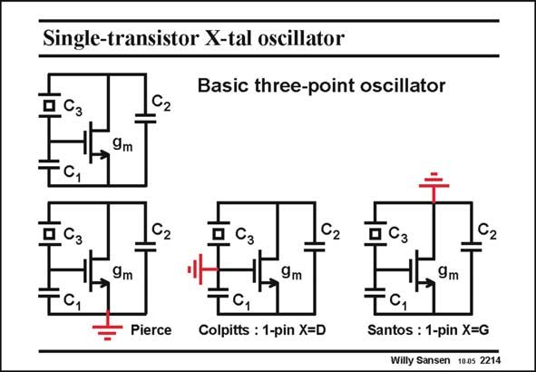

# SANSEN-2214 · Single-transistor X-tal oscillator

章节：22 晶体振荡器设计  
PDF 页：673；书本页：684；幻灯片编号：2214  
状态：unreviewed



## 对应教材讲解

### PDF 672 · 书本 683

This circuit is shown on top. The crystal is connected between Drain and Gate to provide gain. The biasing components are omitted. This basic single-transistor oscillator gives rise to three different oscillator circuits depending on which node is connected to ground. The output terminals obviously also depend on which node is connected to ground. In the Pierce oscillator, the source is grounded such that the transistor seems to function as

### PDF 673 · 书本 684

an amplifier. At resonance, the crystal behaves as a small resistor. The voltages at the Drain and at the Gate are almost identical. The output can therefore be taken either at the Gate or at the Drain. In the Colpitts oscillator, the Gate is grounded. The crystal is also grounded. It is a single-pin oscillator with the crystal connected to the Drain. The transistor looks more like a source follower. The output can only be taken at the Source. Indeed the Drain only carries a very small signal as it is connected to ground by the crystal, which behaves as a small resistor. In the third oscillator, the Drain is grounded. It is a single-pin oscillator with the crystal connected to the Gate. The transistor looks more like a cascode. The output can only be taken at the Source again. The Gate is connected to ground by the crystal, which behaves as a small resistor. The current output can also be taken by insertion of a current mirror in the Drain to ground connection.

## 公式／性能结论候选摘录

以下为规则截取的原文，尚未逐项判读。

- PDF 672: The crystal is connected between Drain and Gate to provide gain.
- PDF 672: This basic single-transistor oscillator gives rise to three different oscillator circuits depending on which node is connected to ground.
- PDF 672: The output terminals obviously also depend on which node is connected to ground.
- PDF 673: The output can therefore be taken either at the Gate or at the Drain.

## 曲线结论候选摘录

以下为规则截取的原文，尚未逐项判读。

（未由规则找到；不代表原页没有此类内容。）

## 原文条件与近似候选摘录

以下为规则截取的原文，尚未逐项判读。

（未由规则找到；不代表原页没有此类内容。）

## 幻灯片 OCR（未校正）

```text
Single-transistor X-tal oscillator
Basic three-point oscillator
C2
9m
C,
Д Cз
C2
C2
C2
9m
- Pierce
9m
TC1
Colpitts : 1-pin X=D
9m
Santos : 1-pin X=G
Willy Sansen 1005 2214
```

数学上下标、分数及正负号以原图为准。电路图已保留；未核对的连接不输出成可仿真 netlist。
