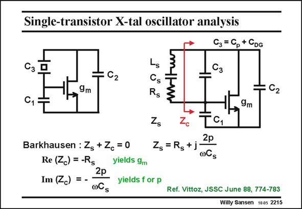

# SANSEN-2215 · Single-transistor X-tal oscillator analysis C3 = Cp + CDG

章节：22 晶体振荡器设计  
PDF 页：673；书本页：684；幻灯片编号：2215  
状态：unreviewed



## 对应教材讲解

### PDF 673 · 书本 684

The analysis of the oscillation condition now applies to all three configurations. For this purpose, the package capacitance C is p included in capacitance C . 3 The transistor capacitance C is included in C and GS 1 the total output capacitance is C . 2 What value of g is m required for sustained oscillation? We carry out a split analysis with the crystal on one side and the circuit with all three capacitances on the other side. Barkhausen requires the sum of both impedances to be zero, which can be written in both the Real and Imaginary part. Since the Real part of the crystal impedance is only R , we find that the circuit must present s

### PDF 674 · 书本 685

a negative resistance Re(Z ) equal to −R . This will yield a minimum value of transconductc s ance g . m Also, the imaginary part of the crystal must equal the negative Imaginary part of the circuit Im(Z ). Since this is an inductor, the circuit must present a capacitance, as expected. This c expression will yield the actual oscillation frequency or the pulling factor p.

## 公式／性能结论候选摘录

以下为规则截取的原文，尚未逐项判读。

- PDF 674: a negative resistance Re(Z ) equal to −R .
- PDF 674: This will yield a minimum value of transconductc s ance g . m Also, the imaginary part of the crystal must equal the negative Imaginary part of the circuit Im(Z ).

## 曲线结论候选摘录

以下为规则截取的原文，尚未逐项判读。

（未由规则找到；不代表原页没有此类内容。）

## 原文条件与近似候选摘录

以下为规则截取的原文，尚未逐项判读。

（未由规则找到；不代表原页没有此类内容。）

## 幻灯片 OCR（未校正）

```text
Single-transistor X-tal oscillator analysis
C3 = Cp + CDG
Сз
Сз
C1
C2
9m
Gs
Rs
:C2
9m
C1
2p
Zs=Rs+j
oCs
Barkhausen : Zs + Zc =0
Re (<c) = -Rg
2p
Im (Zc) = -
yields 9m
yields for p
Ref. Vittoz, JSSC June 88, 774-783
Willy Sansen 1005 2215
```

数学上下标、分数及正负号以原图为准。电路图已保留；未核对的连接不输出成可仿真 netlist。
