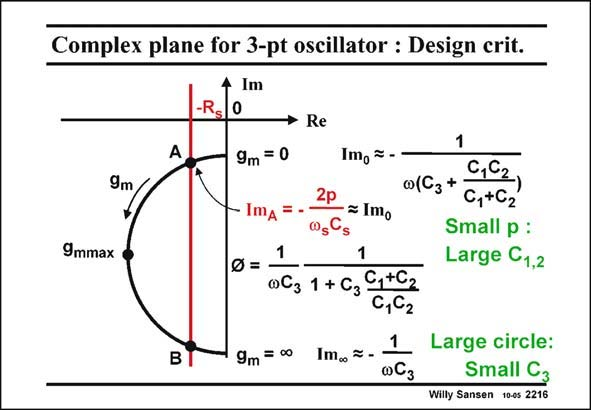

# SANSEN-2216 · Complex plane for 3-pt oscillator : Design crit.

章节：22 晶体振荡器设计  
PDF 页：674；书本页：685；幻灯片编号：2216  
状态：unreviewed



## 对应教材讲解

### PDF 674 · 书本 685

To avoid having to solve complicated expressions, we resort to a graphical method. The impedance Z c presented by the circuit is plotted in the polar diagram. It is a half circle (see Appendix Polar diagrams) which starts on the Imaginary axis for zero g m and ends up on the same axis for infinite g . Where m this half circle intersects the line of −R , the first s Barkhausen oscillation condition is satisfied. Indeed, in this point A, the circuit presents a negative resistance −R , which s exactly compensates the damping resistor R of the crystal. Oscillation is therefore guaranteed. s Moreover, the second Barkhausen condition teaches us that in point A, the Imaginary part gives the pulling factor and therefore the actual frequency. This Imaginary part is very close however, to the Imaginary part at zero g . This latter one is easily calculated as it is a combination m of capacitances (see Appendix Polar diagrams). Stable oscillation is achieved for a well defined crossing point A. The circle must be large, which now requires a small capacitor C . 3 For a small pulling factor p, we need to have large capacitors C and C . They are usually 1 2 taken at the same. Large capacitors C will require a large current, however. This is the 1,2 compromise to be taken!

## 公式／性能结论候选摘录

以下为规则截取的原文，尚未逐项判读。

- PDF 674: Oscillation is therefore guaranteed. s Moreover, the second Barkhausen condition teaches us that in point A, the Imaginary part gives the pulling factor and therefore the actual frequency.

## 曲线结论候选摘录

以下为规则截取的原文，尚未逐项判读。

- PDF 674: The impedance Z c presented by the circuit is plotted in the polar diagram.
- PDF 674: It is a half circle (see Appendix Polar diagrams) which starts on the Imaginary axis for zero g m and ends up on the same axis for infinite g .

## 原文条件与近似候选摘录

以下为规则截取的原文，尚未逐项判读。

（未由规则找到；不代表原页没有此类内容。）

## 幻灯片 OCR（未校正）

```text
Complex plane for 3-pt oscillator : Design crit.
• Im
-Rs
0
• Re
9m
9mmax
B
1
9m = 0
Imo = -
ImA
= Imo
0(C3+
C,62,
C,+C2
Small p :
Large C1,2
9m = 0•
1|
-
•C3
1 + Сз
C,+62
6,62
1
Im. -
∞C3
Large circle:
Small C3
Willy Sansen 10-os 2216
```

数学上下标、分数及正负号以原图为准。电路图已保留；未核对的连接不输出成可仿真 netlist。
