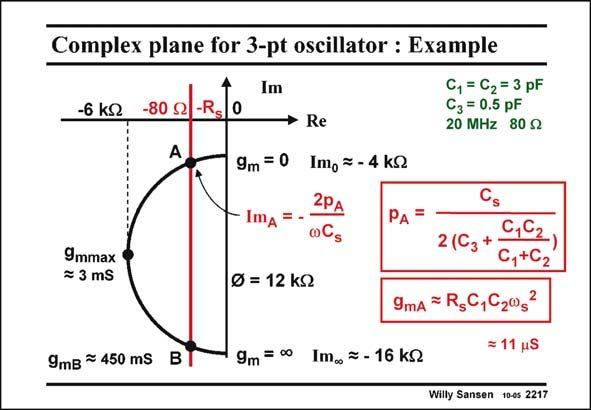

# SANSEN-2217 · Complex plane for 3-pt oscillator : Example C, = C2 = 3 pF

章节：22 晶体振荡器设计  
PDF 页：675；书本页：686；幻灯片编号：2217  
状态：unreviewed



## 对应教材讲解

### PDF 674 · 书本 685

A numerical example is shown in this slide. Also, the expressions of the pulling factor p and A the transconductance g at point A are added (see Appendix Polar diagrams). mA Capacitance C is taken to be as small as possible. It cannot be smaller than the crystal 3 package capacitance, however! The circle has a diameter of 12 kV. For zero g , the Imaginary part is −4 kV. Point A is m actually much closer to the Imaginary axis than drawn, since R is relatively small. s At point A, the transconductance g is 11 mS, and increases along the half circle to infinity. mA It is obviously proportional to the damping resistor R , and also to the square of capacitor C s 1 (=C ) and the series resonance frequency. The realization of a GHz oscillator will require a 2 large current!

### PDF 675 · 书本 686

The pulling factor p is A about C /C . It can only be s 1 made small by increasing C , which increases g con- 1 mA siderably indeed. The choice of C (=C ) is 1 2 the only design choice to be made. It sets at the same time the pulling factor and the current consumption.

## 公式／性能结论候选摘录

以下为规则截取的原文，尚未逐项判读。

- PDF 674: Point A is m actually much closer to the Imaginary axis than drawn, since R is relatively small. s At point A, the transconductance g is 11 mS, and increases along the half circle to infinity. mA It is obviously proportional to the damping resistor R , and also to the square of capacitor C s 1 (=C ) and the series resonance frequency.
- PDF 675: It can only be s 1 made small by increasing C , which increases g con- 1 mA siderably indeed.

## 曲线结论候选摘录

以下为规则截取的原文，尚未逐项判读。

- PDF 674: Point A is m actually much closer to the Imaginary axis than drawn, since R is relatively small. s At point A, the transconductance g is 11 mS, and increases along the half circle to infinity. mA It is obviously proportional to the damping resistor R , and also to the square of capacitor C s 1 (=C ) and the series resonance frequency.

## 原文条件与近似候选摘录

以下为规则截取的原文，尚未逐项判读。

（未由规则找到；不代表原页没有此类内容。）

## 幻灯片 OCR（未校正）

```text
Complex plane for 3-pt oscillator : Example
Im
-6 kJ
-80 S2
-Rs
0
C, = C2 = 3 pF
C3 = 0,5 pF
20 MHz 80 52
9m = 0
ImA
9mmax
= 3 mS
Re
Imo = - 4 kQ
2PА
PA
0Cs
0 = 12 kJ
9mB = 450 mS
B
9m = 0•
Im. = - 16 kQ
2(C3+
C,G2,
C,+C2
9mA = R,C,C2032
= 11 uS
Willy Sansen 10-0s 2217
```

数学上下标、分数及正负号以原图为准。电路图已保留；未核对的连接不输出成可仿真 netlist。
