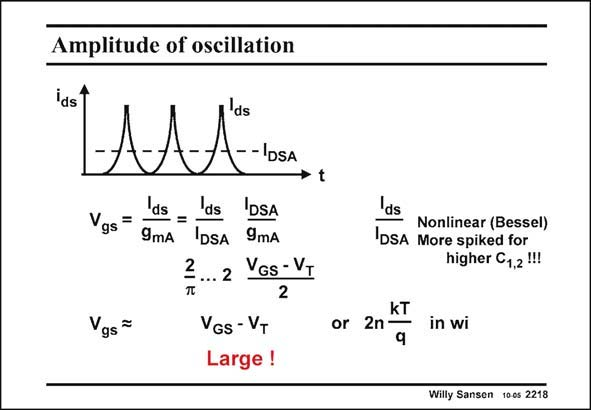

# SANSEN-2218 · Amplitude of oscillation

章节：22 晶体振荡器设计  
PDF 页：675；书本页：686；幻灯片编号：2218  
状态：unreviewed



## 对应教材讲解

### PDF 675 · 书本 686

What amplitude can now be expected from such an oscillator? Remember that the amplitude at the Gate and Drain (with the Source as reference) are just about equal, as Gate and Drain are nearly shorted together by a small resistor R . s The Gate voltage is related to the Drain current by the transconductance. Separating DC and AC components gives an expression, in which the peakto-average current ratio I /I appears and the V −V . ds DSA GS T This ratio depends on how much the transistor is overdriven. For large overdrive or large oscillation amplitude, the current is very nonlinear. This ratio can now be fairly large. The transistor must certainly be designed for large V −V . This is a problem for bipolar GS T circuits unless some emitter resistors are inserted. Also, weak inversion operation yields only small signal voltages.

## 公式／性能结论候选摘录

以下为规则截取的原文，尚未逐项判读。

- PDF 675: Remember that the amplitude at the Gate and Drain (with the Source as reference) are just about equal, as Gate and Drain are nearly shorted together by a small resistor R . s The Gate voltage is related to the Drain current by the transconductance.
- PDF 675: Separating DC and AC components gives an expression, in which the peakto-average current ratio I /I appears and the V −V . ds DSA GS T This ratio depends on how much the transistor is overdriven.

## 曲线结论候选摘录

以下为规则截取的原文，尚未逐项判读。

- PDF 675: Separating DC and AC components gives an expression, in which the peakto-average current ratio I /I appears and the V −V . ds DSA GS T This ratio depends on how much the transistor is overdriven.

## 原文条件与近似候选摘录

以下为规则截取的原文，尚未逐项判读。

（未由规则找到；不代表原页没有此类内容。）

## 幻灯片 OCR（未校正）

```text
Amplitude of oscillation
ids
AA
--DSA
Vgs= ds
-= ds
IDSA
9mA
IDSA 9mA
22 Yos-VT
Vgs=
VGS - VT
Large !
t
kT
or 2n-
q
Ids
Nonlinear (Bessel)
IDSA More spiked for
higher C1,2!!
in wi
Willy Sansen 100s 2218
```

数学上下标、分数及正负号以原图为准。电路图已保留；未核对的连接不输出成可仿真 netlist。
