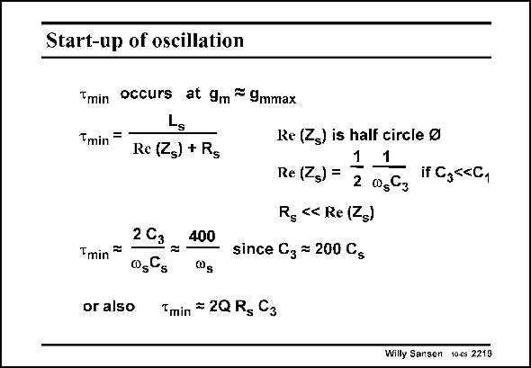

# SANSEN-2219 · Start-up of oscillation

章节：22 晶体振荡器设计  
PDF 页：676；书本页：687；幻灯片编号：2219  
状态：unreviewed



## 对应教材讲解

### PDF 676 · 书本 687

The startup time constant is determined by the inductor and by the negative resistance, seen by it. The minimum time constant is obtained for the maximum resistance Re(Z ) at g . c mmax This is the radius of the half circle. Substitution of the inductance yields an expression which shows that the startup time constant is about 400 periods. We have assumed that the minimum C equals the package 3 capacitance, which is about 200 times C . s In order to reach quiescent operation (within 5%), about 3 time constants are required or 1200 periods. A crystal oscillator is therefore a very slow starter! This is the same as saying that crystal oscillators have very high quality factors!

## 公式／性能结论候选摘录

以下为规则截取的原文，尚未逐项判读。

- PDF 676: We have assumed that the minimum C equals the package 3 capacitance, which is about 200 times C . s In order to reach quiescent operation (within 5%), about 3 time constants are required or 1200 periods.
- PDF 676: A crystal oscillator is therefore a very slow starter!

## 曲线结论候选摘录

以下为规则截取的原文，尚未逐项判读。

（未由规则找到；不代表原页没有此类内容。）

## 原文条件与近似候选摘录

以下为规则截取的原文，尚未逐项判读。

- PDF 676: We have assumed that the minimum C equals the package 3 capacitance, which is about 200 times C . s In order to reach quiescent operation (within 5%), about 3 time constants are required or 1200 periods.

## 幻灯片 OCR（未校正）

```text
Start-up of oscillation
Tmin occurs at 9m = 9mmax
Tmin -
Re (Zs) + Rg
Tmin =
or also
2G2 100
00gCs
0g
Re (Zs) is half circle e
1
Re (Zg) =
2
1
0sC3
Rg «< Re (Zs)
since Gz = 200 Cs
Tmin = 2Q R, C3
if C355C1
Willy Sansen tes 2218
```

数学上下标、分数及正负号以原图为准。电路图已保留；未核对的连接不输出成可仿真 netlist。
