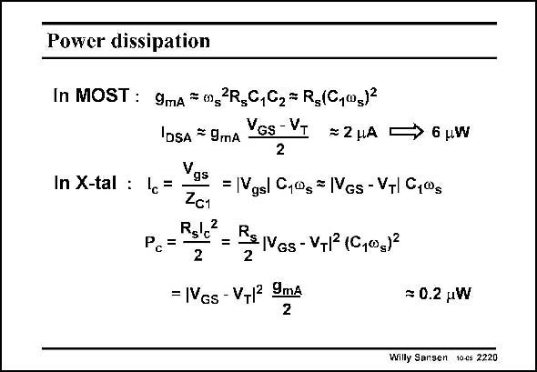

# SANSEN-2220 · Power dissipation

章节：22 晶体振荡器设计  
PDF 页：676；书本页：687；幻灯片编号：2220  
状态：unreviewed



## 对应教材讲解

### PDF 676 · 书本 687

The power dissipation in the transistor and in the crystal depend to a large extent on the values of the capacitors chosen. For capacitors C in the 1 order of magnitude of pF’s, the currents are quite small. The power dissipation is then quite small and no self heating is expected. Only when large values of C are selected, to be as 1 close as possible to the series resonance frequency, the currents rise with the square of the capacitance value. The power dissipation then rises quickly as well.

## 公式／性能结论候选摘录

以下为规则截取的原文，尚未逐项判读。

- PDF 676: The power dissipation in the transistor and in the crystal depend to a large extent on the values of the capacitors chosen.

## 曲线结论候选摘录

以下为规则截取的原文，尚未逐项判读。

（未由规则找到；不代表原页没有此类内容。）

## 原文条件与近似候选摘录

以下为规则截取的原文，尚未逐项判读。

（未由规则找到；不代表原页没有此类内容。）

## 幻灯片 OCR（未校正）

```text
Power dissipation
In MOST : 9mA (g2Rg0,02= R5(G,00g)}
IDSA * 9mA
VGs - V
* 2 HA
In X-tal : c
Vgs
= |Vgsl C,0g = |VGs - VT| G,0s
Zc1
Rslc2
PcF
N
Be IVGs - VT1 (G,003)2
6 uW
= |VGs - VTI УmА
= 0.2 uW
Willy Sansen tocs 2220
```

数学上下标、分数及正负号以原图为准。电路图已保留；未核对的连接不输出成可仿真 netlist。
