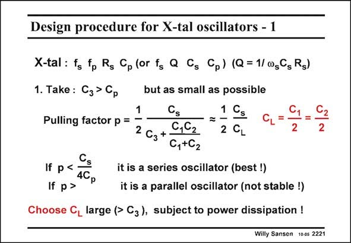

# SANSEN-2221 · Design procedure for X-tal oscillators - 1

章节：22 晶体振荡器设计  
PDF 页：677；书本页：688；幻灯片编号：2221  
状态：unreviewed



## 对应教材讲解

### PDF 677 · 书本 688

From the discussion, it is easy to derive a design procedure. A crystal is characterized by its two resonance frequencies, the series resistor and the package capacitance, which are all easily measured. We first choose the capacitor C as small as 3 possible. Obviously, it cannot be smaller than the package capacitance C . p We now have to select a value for 2C =C =C as a L 1 2 compromise to reduce the pulling factor and to avoid too much power consumption.

## 公式／性能结论候选摘录

以下为规则截取的原文，尚未逐项判读。

（未由规则找到；不代表原页没有此类内容。）

## 曲线结论候选摘录

以下为规则截取的原文，尚未逐项判读。

（未由规则找到；不代表原页没有此类内容。）

## 原文条件与近似候选摘录

以下为规则截取的原文，尚未逐项判读。

（未由规则找到；不代表原页没有此类内容。）

## 幻灯片 OCR（未校正）

```text
Design procedure for X-tal oscillators - 1
X-tal : fs fp Rg Cp (or fg Q Gs Cp) (Q = 1/ 0,G Rg)
1. Take : C3 > Ср
Pulling factor p =
If
p<
4Cp
If p >
but as small as possible
1
Cs
1 Cs
=
2
Сз
0,62
C,+C2
2 CL
it is a series oscillator (best !)
it is a parallel oscillator (not stable !)
Choose CL large (> C3), subject to power dissipation !
2
Willy Sansen 100s 2221
```

数学上下标、分数及正负号以原图为准。电路图已保留；未核对的连接不输出成可仿真 netlist。
