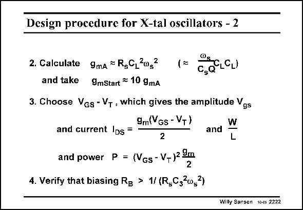

# SANSEN-2222 · Design procedure for X-tal oscillators - 2

章节：22 晶体振荡器设计  
PDF 页：677；书本页：688；幻灯片编号：2222  
状态：unreviewed



## 对应教材讲解

### PDF 677 · 书本 688

The required transconductance is then easily calculated. As a starting value we take about ten times more transconductance. The V −V will deter- GS T mine the current itself and the output amplitude. A large value is selected. Finally, if we want to connect the Gate of the oscillator to a biasing voltage over a resistor R , we have to B make sure that the additional damping due to this resistor is negligible. It must be sufficiently large. This expression is taken from Ref. Vittoz (see slide 15).

## 公式／性能结论候选摘录

以下为规则截取的原文，尚未逐项判读。

（未由规则找到；不代表原页没有此类内容。）

## 曲线结论候选摘录

以下为规则截取的原文，尚未逐项判读。

（未由规则找到；不代表原页没有此类内容。）

## 原文条件与近似候选摘录

以下为规则截取的原文，尚未逐项判读。

（未由规则找到；不代表原页没有此类内容。）

## 幻灯片 OCR（未校正）

```text
Design procedure for X-tal oscillators - 2
2. Calculate 9mA = R,C,*og
CLCL)
Cs
and take 9mStart = 10 gmA
3. Choose Ves-Vy, which gives the amplitude Vgs
9m(Vgs - V+)
and current IDs =
2
and
W
L
and power P = (Vgs-V-)2m
4. Verify that biasing Rg > 1/ (R,C3*w,3)
Willy Sansen tocs 2222
```

数学上下标、分数及正负号以原图为准。电路图已保留；未核对的连接不输出成可仿真 netlist。
