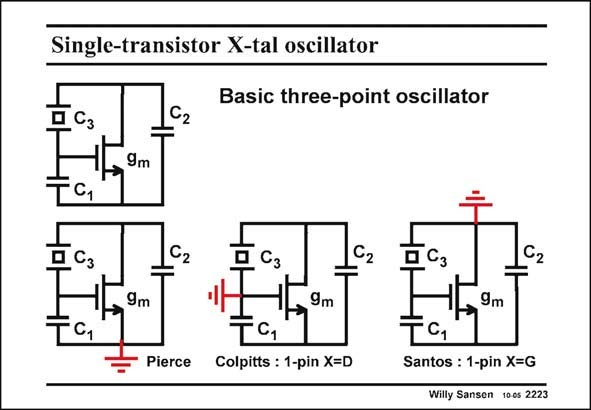

# SANSEN-2223 · Single-transistor X-tal oscillator

章节：22 晶体振荡器设计  
PDF 页：678；书本页：689；幻灯片编号：2223  
状态：unreviewed



## 对应教材讲解

### PDF 678 · 书本 689

Let us now consider how these three types of grounding can be realized. Attention is paid to biasing as well. Simple discrete realizations are considered first.

## 公式／性能结论候选摘录

以下为规则截取的原文，尚未逐项判读。

（未由规则找到；不代表原页没有此类内容。）

## 曲线结论候选摘录

以下为规则截取的原文，尚未逐项判读。

（未由规则找到；不代表原页没有此类内容。）

## 原文条件与近似候选摘录

以下为规则截取的原文，尚未逐项判读。

（未由规则找到；不代表原页没有此类内容。）

## 幻灯片 OCR（未校正）

```text
Single-transistor X-tal oscillator
Сз
C2
Basic three-point oscillator
-9m
C1
Сз
5.
C2
TC1
- Pierce
9m
TG
Colpitts : 1-pin X=D
9m
TC1
Santos : 1-pin X=G
Willy Sansen 100s 2223
```

数学上下标、分数及正负号以原图为准。电路图已保留；未核对的连接不输出成可仿真 netlist。
