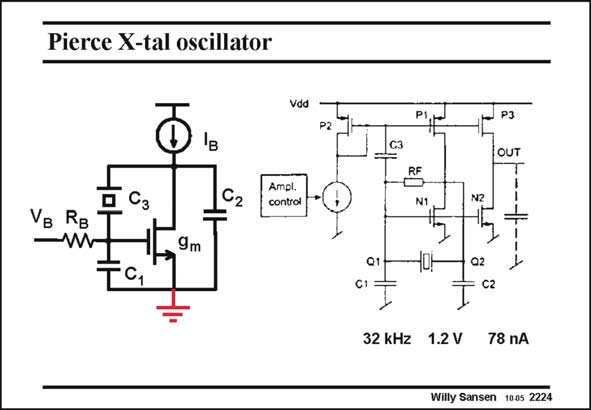

# SANSEN-2224 · Pierce X-tal oscillator

章节：22 晶体振荡器设计  
PDF 页：678；书本页：689；幻灯片编号：2224  
状态：unreviewed



## 对应教材讲解

### PDF 678 · 书本 689

A Pierce oscillator is best biased by a current source I and a Gate biasing resis- B tor V . B This current source is the best guarantee that the circuit is isolated from the supply line. Otherwise, the oscillator will superimpose spikes at the oscillation frequency on all supply lines connected to it. A CMOS realization is shown on the right. The crystal is connected between Drain and Gate, which makes it a Pierce oscillator. Also, the capacitances are indicated. The current source I is set by an external current, which is determined by an Automatic- B Gain-Control system. Such a system measures the output signal and adjusts the DC current to keep the oscillator at point A. The output signal is taken by duplicating the amplifier transistor. In this way the load at the output cannot influence the oscillation condition. One subtlety is capacitor C3. Actually, it is in parallel with capacitor C1 and smoothens somewhat the output current.

## 公式／性能结论候选摘录

以下为规则截取的原文，尚未逐项判读。

- PDF 678: The current source I is set by an external current, which is determined by an Automatic- B Gain-Control system.

## 曲线结论候选摘录

以下为规则截取的原文，尚未逐项判读。

（未由规则找到；不代表原页没有此类内容。）

## 原文条件与近似候选摘录

以下为规则截取的原文，尚未逐项判读。

（未由规则找到；不代表原页没有此类内容。）

## 幻灯片 OCR（未校正）

```text
Pierce X-tal oscillator
Vdd
P2
'в
Vg Rg
—W
Ampl.
control
9m
TC,
P1
C3
N1
N2
JP3
OUT
T
+
Q1
C1
-DH
Q2
C2
32 kHz 1.2 V 78 nA
Willy Sansen 1005 2224
```

数学上下标、分数及正负号以原图为准。电路图已保留；未核对的连接不输出成可仿真 netlist。
