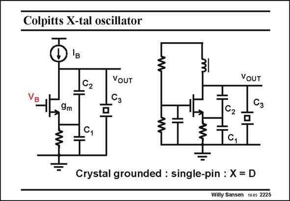

# SANSEN-2225 · Colpitts X-tal oscillator

章节：22 晶体振荡器设计  
PDF 页：679；书本页：690；幻灯片编号：2225  
状态：unreviewed



## 对应教材讲解

### PDF 679 · 书本 690

An example of a Colpitts oscillator is shown in this slide. Indeed it is a singlepin oscillator with the crystal connected to the Drain. Again, it is biased by a current source I to provide B adequate isolation from the supply line. A discrete equivalent is shown on the right. The current source is replaced by a ‘‘choke’’ or large inductor. The capacitors are exactly where they are expected. The output voltage is taken at the Drain, as shown by most publications. It may not be the best place, however. At resonance, the crystal is a little more than a small resistor. The signal swing at the Drain is therefore quite small. A better output node is the Source or Emitter, between capacitors C and C . 1 2

## 公式／性能结论候选摘录

以下为规则截取的原文，尚未逐项判读。

- PDF 679: The signal swing at the Drain is therefore quite small.

## 曲线结论候选摘录

以下为规则截取的原文，尚未逐项判读。

（未由规则找到；不代表原页没有此类内容。）

## 原文条件与近似候选摘录

以下为规则截取的原文，尚未逐项判读。

（未由规则找到；不代表原页没有此类内容。）

## 幻灯片 OCR（未校正）

```text
Colpitts X-tal oscillator
31
162
VOUT
VoUT
9m
C2
Tc,
Crystal grounded : single-pin : X = D
Willy Sansen 1005 2225
```

数学上下标、分数及正负号以原图为准。电路图已保留；未核对的连接不输出成可仿真 netlist。
