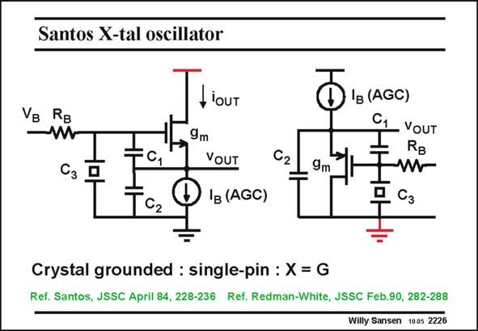

# SANSEN-2226 · Santos X-tal oscillator

章节：22 晶体振荡器设计  
PDF 页：679；书本页：690；幻灯片编号：2226  
状态：unreviewed



## 对应教材讲解

### PDF 679 · 书本 690

The third type of oscillator is shown in this slide. Some more recent references are added on these integrated oscillators. It is again a single-pin oscillator but now with the crystal connected to the Gate. The Source is now the output. The transistor is biased by a current source, which is part of an Automatic Gain Control system, as will be discussed later. The output can also be taken by a current source inserted in the Drain. Since the Drain is grounded, this is a very elegant way to obtain an output signal without disturbing the oscillator itself. Both last oscillator types are single-pin oscillators. This means that the crystal is grounded. This may add more parasitic capacitance in parallel to the crystal however than in the Pierce oscillator. This is why Pierce is often preferred despite the fact that it requires two pins for the crystal.

## 公式／性能结论候选摘录

以下为规则截取的原文，尚未逐项判读。

- PDF 679: The transistor is biased by a current source, which is part of an Automatic Gain Control system, as will be discussed later.

## 曲线结论候选摘录

以下为规则截取的原文，尚未逐项判读。

（未由规则找到；不代表原页没有此类内容。）

## 原文条件与近似候选摘录

以下为规则截取的原文，尚未逐项判读。

（未由规则找到；不代表原页没有此类内容。）

## 幻灯片 OCR（未校正）

```text
Santos X-tal oscillator
VB
. RB
Сз
Tcz
- lOUT
9m
VOUT
lg (AGC)
O'(A6C)
C,
9m
VOUT
RB
4 Cз
Crystal grounded : single-pin : X = G
Ref. Santos, JSSC April 84, 228-236 Ref. Redman-White, JSSC Feb.90, 282-288
Willy Sansen 1005 2226
```

数学上下标、分数及正负号以原图为准。电路图已保留；未核对的连接不输出成可仿真 netlist。
