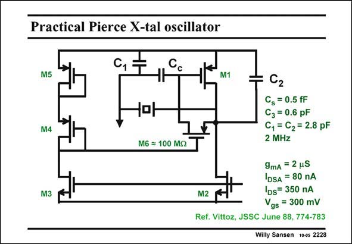

# SANSEN-2228 · Practical Pierce X-tal oscillator

章节：22 晶体振荡器设计  
PDF 页：680；书本页：691；幻灯片编号：2228  
状态：unreviewed



## 对应教材讲解

### PDF 680 · 书本 691

A practical realization of a Pierce oscillator is shown in this slide. Transistor M is the 1 actual oscillator amplifier. The capacitors C and C 1 2 are indicated. Capacitor C c is a coupling capacitor to separate DC and AC. The output is take at the left side of the crystal. The current is set by transistor M2, which is part of an AGC system shown on the next slide. The biasing resistor R is B now represented by transistor M6. It is biased at zero V such that its resistance can be quite DS high although inaccurate. This is achieved by connecting two diodes to the Gate of M6. Both Source and Drain of M6 are at one single V below the supply voltage. GS The numerical values indicate that all capacitances are quite small in order to limit the power consumption to a minimum. All transistors work in weak inversion!

## 公式／性能结论候选摘录

以下为规则截取的原文，尚未逐项判读。

- PDF 680: GS The numerical values indicate that all capacitances are quite small in order to limit the power consumption to a minimum.

## 曲线结论候选摘录

以下为规则截取的原文，尚未逐项判读。

（未由规则找到；不代表原页没有此类内容。）

## 原文条件与近似候选摘录

以下为规则截取的原文，尚未逐项判读。

（未由规则找到；不代表原页没有此类内容。）

## 幻灯片 OCR（未校正）

```text
Practical Pierce X-tal oscillator
M5
M4
M6 = 100 MS
M3
M1
C2
Cg = 0.5 fF
C3 = 0.6 pF
C, = C2 = 2.8 pF
2 MHz
9mA = 2 uS
IDSA = 80 nA
M2
IDs= 350 пA
Vgs = 300 mV
Ref. Vittoz, JSSC June 88, 774-783
Willy Sansen 10-0s 2228
```

数学上下标、分数及正负号以原图为准。电路图已保留；未核对的连接不输出成可仿真 netlist。
