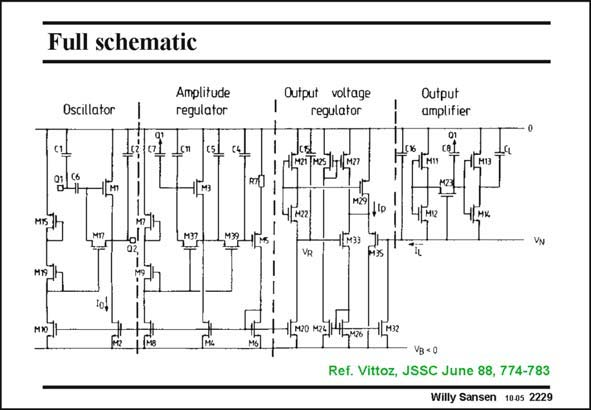

# SANSEN-2229 · Full schematic

章节：22 晶体振荡器设计  
PDF 页：681；书本页：692；幻灯片编号：2229  
状态：unreviewed



## 对应教材讲解

### PDF 680 · 书本 691

The AGC circuit is now easily found. It is called an Amplitude Regulator. The output of the oscillator, at the left of the crystal, is connected to the Q1 input of the AGC circuit, in series with a coupling capacitor C7. It is also connected to the Q1 input of the Output Amplifier, towards a series of inverters.

### PDF 681 · 书本 692

In the Amplitude Regulator, the input Q1 drives the Gate of transistor M3, which operates somewhat as a rectifier. When a MOST is overdriven, its average current increases, which is a measure for the input voltage amplitude. This simple rectifier is followed by a low-pass filter made up by capacitors C 4 and C and transistor M39. 5 This latter transistor operates as a large resistor because its V is again zero. DS The voltage at transistor M5 is now converted to a current, by use of resistor R7, and fed back to the oscillator transistor M1 by means of current mirror M6–M2. The AGC loop works as follows. When no signal is present, the Gate voltage of M5 is fairly low and a large current is sent to M1. When the oscillation has come up, more current is flowing through M3 such that the gate of M5 increases. As a result, the current in M3 decreases and so does the current in M1. In equilibrium, the AGC circuit maintains the minimum current for which oscillation is sustained, which corresponds with point A.

## 公式／性能结论候选摘录

以下为规则截取的原文，尚未逐项判读。

- PDF 681: When a MOST is overdriven, its average current increases, which is a measure for the input voltage amplitude.
- PDF 681: When the oscillation has come up, more current is flowing through M3 such that the gate of M5 increases.
- PDF 681: As a result, the current in M3 decreases and so does the current in M1.

## 曲线结论候选摘录

以下为规则截取的原文，尚未逐项判读。

（未由规则找到；不代表原页没有此类内容。）

## 原文条件与近似候选摘录

以下为规则截取的原文，尚未逐项判读。

（未由规则找到；不代表原页没有此类内容。）

## 幻灯片 OCR（未校正）

```text
Full schematic
Oscillator
Amplitude
regulator
MIS
M3д
Output voltage
regulator
Output
amplifier
1| M19|
TAMs
101
4/422
34
,lp
M12
Чрнк
VR
4[м32
Vg < 0
Ref. Vittoz, JSSC June 88, 774-783
Willy Sansen 1005 2229
```

数学上下标、分数及正负号以原图为准。电路图已保留；未核对的连接不输出成可仿真 netlist。
