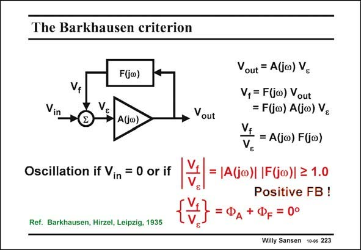

# SANSEN-223 · The Barkhausen criterion

章节：22 晶体振荡器设计  
PDF 页：667；书本页：678；幻灯片编号：223  
状态：unreviewed



## 对应教材讲解

### PDF 666 · 书本 677

An oscillator is a kind of feedback amplifier. The signal that is fed back is exactly what the amplifier requires, to sustain oscillation. Its input is now zero. This is called the Barkhausen criterion. The amplifier has a gain A( jv) which depends on frequency. Also, the feedback block has an attenuation F( jv) which is frequency dependent. The loop gain F( jv)A( jv) must be large enough so that the signal v which is fed back, exactly equals v , which is required. f e As a consequence, the loop gain must be slightly larger than unity in amplitude and its phase zero.

### PDF 667 · 书本 678

This means that A( jv) must be an amplifier if F( jv) is an attenuator. This also means that F( jv) must be inductive if A( jv) is capacitive. All amplifiers that we have seen contain capacitances. As a consequence, we are looking for an inductor for F( jv). Clearly, these two conditions are a result of the complex nature of both A( jv) and F( jv). Complex numbers are always pairs of numbers!

## 公式／性能结论候选摘录

以下为规则截取的原文，尚未逐项判读。

- PDF 666: The amplifier has a gain A( jv) which depends on frequency.
- PDF 666: Also, the feedback block has an attenuation F( jv) which is frequency dependent.
- PDF 666: The loop gain F( jv)A( jv) must be large enough so that the signal v which is fed back, exactly equals v , which is required. f e As a consequence, the loop gain must be slightly larger than unity in amplitude and its phase zero.

## 曲线结论候选摘录

以下为规则截取的原文，尚未逐项判读。

- PDF 666: The loop gain F( jv)A( jv) must be large enough so that the signal v which is fed back, exactly equals v , which is required. f e As a consequence, the loop gain must be slightly larger than unity in amplitude and its phase zero.

## 原文条件与近似候选摘录

以下为规则截取的原文，尚未逐项判读。

（未由规则找到；不代表原页没有此类内容。）

## 幻灯片 OCR（未校正）

```text
The Barkhausen criterion
Vin
F(jo)
V: Aio)
Vout
Oscillation if Vin = 0 or if
Ref. Barkhausen, Hirzel, Leipzig, 1935
out = A(jo) Ve
Vf= F(jw) Vout
= F(jo) A(jo) Ve
= A(jo) Fjo)
Vs
= |A(jo)| |F(j∞)| ≥ 1.0
Positive FB!
Ф
+ Фр = 0°
Willy Sansen 10-05 223
```

数学上下标、分数及正负号以原图为准。电路图已保留；未核对的连接不输出成可仿真 netlist。
