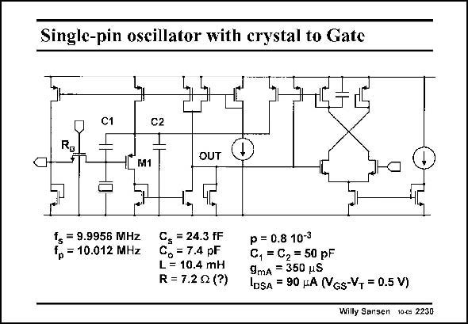

# SANSEN-2230 · Single-pin oscillator with crystal to Gate

章节：22 晶体振荡器设计  
PDF 页：681；书本页：692；幻灯片编号：2230  
状态：unreviewed



## 对应教材讲解

### PDF 681 · 书本 692

Another practical oscillator of the third type is shown in this slide. It is a single-pin oscillator, with the crystal connected to the Gate. The output current is measured at the Drain of transistor M1. The output stage is a wideband amplifier. The AGC amplifier is shown at the right of the output terminal. A differential pair is used as a rectifier with just one capacitor as a low-pass filter. The output current is now sent to the oscillator transistor M1. All numerical values are added to allow the reader to fully explore this circuit.

## 公式／性能结论候选摘录

以下为规则截取的原文，尚未逐项判读。

（未由规则找到；不代表原页没有此类内容。）

## 曲线结论候选摘录

以下为规则截取的原文，尚未逐项判读。

（未由规则找到；不代表原页没有此类内容。）

## 原文条件与近似候选摘录

以下为规则截取的原文，尚未逐项判读。

（未由规则找到；不代表原页没有此类内容。）

## 幻灯片 OCR（未校正）

```text
Single-pin oscillator with crystal to Gate
C1
Ro
C2
1
1LM1
OUT
= 9.9956 MHz
fр = 10.012 MHz
C, = 24.3 FF
= 7.4 pF
L = 10.4 mH
R = 7.2Q (?)
0 = 0.8 10-3
C, = C2 = 50 pF
9mA = 350 uS
LDSA = 90 (A (VGs-VT = 0.5 V)
Willy Sansen 10cs 2230
```

数学上下标、分数及正负号以原图为准。电路图已保留；未核对的连接不输出成可仿真 netlist。
