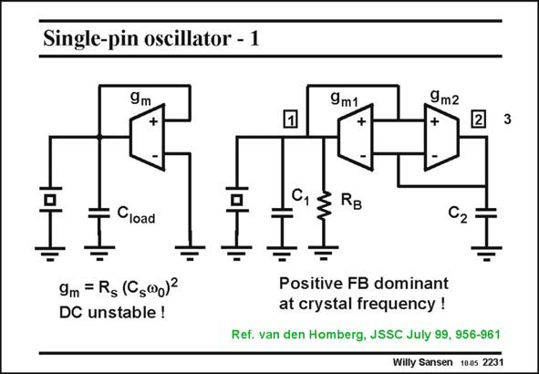

# SANSEN-2231 · Single-pin oscillator - 1

章节：22 晶体振荡器设计  
PDF 页：682；书本页：693；幻灯片编号：2231  
状态：unreviewed



## 对应教材讲解

### PDF 682 · 书本 693

A negative resistance can be generated by a single transistor amplifier but obviously also by a few more transistors. One example is given which uses CMOS as a technology. Many more will be discussed later, which are realized in bipolar technology. In general, positive feedback always gives rise to negative resistances. In the example in this slide on the left, the negative resistance, because of the positive feedback, must be sufficiently large to compensate for the positive resistor in the crystal, to sustain oscillation. The minimum transconductance is obviously the same as before. However, this circuit is unstable for DC operation. A better realization is shown on the right. At all frequencies, except around the crystal frequency, the negative feedback with g is m2 dominant over the positive feedback with g . As a result, the circuit is stable. At the frequency m1 where the crystal offers a large impedance, the positive feedback dominates and the oscillation is sustained. If the design is such that g /C =g /C , and g =g , then the transconductance is again m1 1 m2 2 m1 m2 given by the expression in this slide.

## 公式／性能结论候选摘录

以下为规则截取的原文，尚未逐项判读。

- PDF 682: As a result, the circuit is stable.

## 曲线结论候选摘录

以下为规则截取的原文，尚未逐项判读。

（未由规则找到；不代表原页没有此类内容。）

## 原文条件与近似候选摘录

以下为规则截取的原文，尚未逐项判读。

（未由规则找到；不代表原页没有此类内容。）

## 幻灯片 OCR（未校正）

```text
Single-pin oscillator - 1
9m
9m1
9m2
+
3
Cload
Gz RB
C2
9m = R5 (Cs@0)2
DC unstable !
Positive FB dominant
at crystal frequency !
Ref. van den Homberg, JSSC July 99, 956-961
Willy Sansen 1005 2231
```

数学上下标、分数及正负号以原图为准。电路图已保留；未核对的连接不输出成可仿真 netlist。
