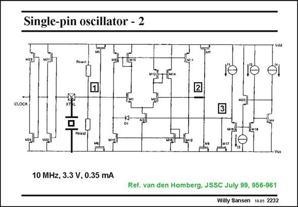

# SANSEN-2232 · Single-pin oscillator - 2

章节：22 晶体振荡器设计  
PDF 页：682；书本页：693；幻灯片编号：2232  
状态：unreviewed



## 对应教材讲解

### PDF 682 · 书本 693

The circuit realization is shown in this slide. The two g blocks are the two input m MOSTs of the differential pair M1/M2. The capacitors C and C are realized by 1 2 means of MOSTs. The AGC is carried out as follows. If the signal amplitude at node 1 is small, then diode D1 is always reverse biased. If the amplitude rises, then the diode becomes forward biased for the negative tips of the sine wave. This threshold is set by the reference voltage at node 3. Because of the forward biasing of diode D1, the voltage at node 3 is pulled down. The current in transistor M3 decreases. The transconductances g and g also decrease. m1 m2

### PDF 683 · 书本 694

The capacitance of transistor M3 reduces the ripple at node 3. A point of equilibrium is reached in this way, which depends on the voltage at node 3.

## 公式／性能结论候选摘录

以下为规则截取的原文，尚未逐项判读。

- PDF 682: The current in transistor M3 decreases.
- PDF 682: The transconductances g and g also decrease. m1 m2
- PDF 683: A point of equilibrium is reached in this way, which depends on the voltage at node 3.

## 曲线结论候选摘录

以下为规则截取的原文，尚未逐项判读。

（未由规则找到；不代表原页没有此类内容。）

## 原文条件与近似候选摘录

以下为规则截取的原文，尚未逐项判读。

（未由规则找到；不代表原页没有此类内容。）

## 幻灯片 OCR（未校正）

```text
Single-pin oscillator - 2
Vdd
Tin
U
CLOCK
B
miei
- Vss
10 MHz, 3.3 V, 0.35 mA
Ref. van den Homberg, JSSC July 99, 956-961
Willy Sansen 1005 2232
```

数学上下标、分数及正负号以原图为准。电路图已保留；未核对的连接不输出成可仿真 netlist。
