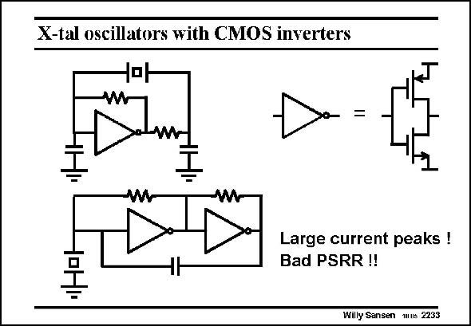

# SANSEN-2233 · X-tal oscillators with CMOS inverters

章节：22 晶体振荡器设计  
PDF 页：683；书本页：694；幻灯片编号：2233  
状态：unreviewed



## 对应教材讲解

### PDF 683 · 书本 694

Of course it is also possible to realize crystal oscillators by means of CMOS inverters as amplifiers. A few examples are given in this slide. Since the gain is usually too high, resistors are added to reduce the gain. Moreover, resistors are added in series with the outputs to limit the output currents. If not, large current spikes are drawn from the supply voltage, which causes large voltage spikes on the supply voltages. They propagate to all other circuits connected to the same supplies. As a result, the Power-supply-rejectionratio is poor. Moreover the gain setting is not so precise. The transistors are always largely overdriven. The oscillation frequency is thus not precise at all, despite the high quality factor of the crystal used.

## 公式／性能结论候选摘录

以下为规则截取的原文，尚未逐项判读。

- PDF 683: Since the gain is usually too high, resistors are added to reduce the gain.
- PDF 683: Moreover, resistors are added in series with the outputs to limit the output currents.
- PDF 683: As a result, the Power-supply-rejectionratio is poor.
- PDF 683: Moreover the gain setting is not so precise.
- PDF 683: The oscillation frequency is thus not precise at all, despite the high quality factor of the crystal used.

## 曲线结论候选摘录

以下为规则截取的原文，尚未逐项判读。

（未由规则找到；不代表原页没有此类内容。）

## 原文条件与近似候选摘录

以下为规则截取的原文，尚未逐项判读。

（未由规则找到；不代表原页没有此类内容。）

## 幻灯片 OCR（未校正）

```text
X-tal oscillators with CMOS inverters
=
Large current peaks !
Bad PSRR !!
Willy Sansen mus 2233
```

数学上下标、分数及正负号以原图为准。电路图已保留；未核对的连接不输出成可仿真 netlist。
