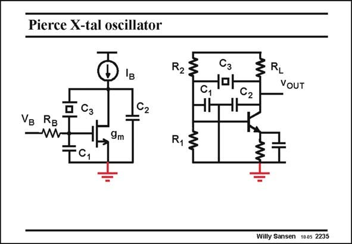

# SANSEN-2235 · Pierce X-tal oscillator

章节：22 晶体振荡器设计  
PDF 页：684；书本页：695；幻灯片编号：2235  
状态：unreviewed



## 对应教材讲解

### PDF 684 · 书本 695

A Pierce oscillator is best biased by a current source I and a Gate biasing resis- B tor V . B A current source is used to isolate the circuit from the supply line. A discrete realization is shown on the right. It uses a bipolar transistor. The crystal is connected between collector and base, which makes it a Pierce oscillator. Also the capacitances are indicated. The current source is replaced by a large resistor R . A resistor is used in the emitter for thermal stabilization. The L capacitor across it has to alleviate the gain reduction caused by the resistor. The resistors R and R provide biasing to the base. 1 2 It is clear that such a circuit can never be biased exactly at point A of the polar diagram. It has fixed biasing at a transconductance which must be a lot larger than g , to always ensure mA oscillation. As a result, the power consumption is never minimum and the oscillation frequency is not very precise.

## 公式／性能结论候选摘录

以下为规则截取的原文，尚未逐项判读。

- PDF 684: The L capacitor across it has to alleviate the gain reduction caused by the resistor.
- PDF 684: As a result, the power consumption is never minimum and the oscillation frequency is not very precise.

## 曲线结论候选摘录

以下为规则截取的原文，尚未逐项判读。

（未由规则找到；不代表原页没有此类内容。）

## 原文条件与近似候选摘录

以下为规则截取的原文，尚未逐项判读。

（未由规则找到；不代表原页没有此类内容。）

## 幻灯片 OCR（未校正）

```text
Pierce X-tal oscillator
R2:
Cз
c, "-
0 Сз
TC,
9m
R,$
ZRL
VOUT
Willy Sansen 1005 2235
```

数学上下标、分数及正负号以原图为准。电路图已保留；未核对的连接不输出成可仿真 netlist。
