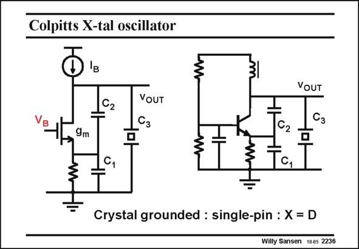

# SANSEN-2236 · Colpitts X-tal oscillator

章节：22 晶体振荡器设计  
PDF 页：684；书本页：695；幻灯片编号：2236  
状态：unreviewed



## 对应教材讲解

### PDF 684 · 书本 695

A Colpitts oscillator is again shown in this slide. Indeed it is a single-pin oscillator with the crystal connected to the Collector. A discrete equivalent with a bipolar transistor is shown on the right. The current source is replaced by a ‘‘choke’’ or large inductor. The capacitors are where they are expected. The output voltage is taken at the Collector, as shown by most publications. This is not the best place however, as at resonance the crystal is little more than a small resistor. The signal swing at the Collector is therefore quite small. A better output node is the Emitter, between capacitors C and C . 1 2 The base is decoupled to ground to make it an AC ground. If not, the effective transconductance would be reduced by the base resistances.

### PDF 685 · 书本 696

A Heartley oscillator is very similar to this one. Both capacitances C and C are substituted 1 2 by inductances, and the crystal operates in the capacitive region. Needless to say that the frequency region of operation is now much wider as the crystal has a much wider region where it behaves as a capacitance.

## 公式／性能结论候选摘录

以下为规则截取的原文，尚未逐项判读。

- PDF 684: The signal swing at the Collector is therefore quite small.

## 曲线结论候选摘录

以下为规则截取的原文，尚未逐项判读。

（未由规则找到；不代表原页没有此类内容。）

## 原文条件与近似候选摘录

以下为规则截取的原文，尚未逐项判读。

（未由规则找到；不代表原页没有此类内容。）

## 幻灯片 OCR（未校正）

```text
Colpitts X-tal oscillator
3
162
VOUT
Сз
9m
VOUT
Cз
Ta,
Crystal grounded : single-pin : X = D
Willy Sansen 1005 2236
```

数学上下标、分数及正负号以原图为准。电路图已保留；未核对的连接不输出成可仿真 netlist。
