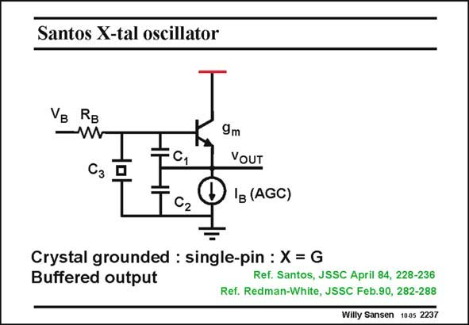

# SANSEN-2237 · Santos X-tal oscillator

章节：22 晶体振荡器设计  
PDF 页：685；书本页：696；幻灯片编号：2237  
状态：unreviewed



## 对应教材讲解

### PDF 685 · 书本 696

The third type of oscillator is again a single-pin oscillator but now with the crystal connected to the Base. The Emitter is now the output. The transistor is biased by a current source, which is part of an Automatic Gain Control system. The output can also be taken by a current source inserted in the Collector. Since the Collector is grounded, this is a very elegant way to obtain an output signal without disturbing the oscillator feedback loop itself.

## 公式／性能结论候选摘录

以下为规则截取的原文，尚未逐项判读。

- PDF 685: The transistor is biased by a current source, which is part of an Automatic Gain Control system.

## 曲线结论候选摘录

以下为规则截取的原文，尚未逐项判读。

（未由规则找到；不代表原页没有此类内容。）

## 原文条件与近似候选摘录

以下为规则截取的原文，尚未逐项判读。

（未由规则找到；不代表原页没有此类内容。）

## 幻灯片 OCR（未校正）

```text
Santos X-tal oscillator
VB RB
— W
9m
YoUT
TCz
Q 'E (AGC)
Crystal grounded : single-pin : X = G
Buffered output
Ref. Santos, JSSC April 84, 228-236
Ref. Redman-White, JSSC Feb.90, 282-288
Willy Sansen 10.05 2237
```

数学上下标、分数及正负号以原图为准。电路图已保留；未核对的连接不输出成可仿真 netlist。
