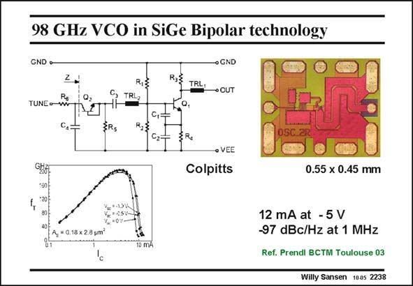

# SANSEN-2238 · 98 GHz VCO in SiGe Bipolar technology

章节：22 晶体振荡器设计  
PDF 页：685；书本页：696；幻灯片编号：2238  
状态：unreviewed



## 对应教材讲解

### PDF 685 · 书本 696

Another example of the same type of oscillator is shown in this slide. It uses high-speed SiCGe bipolar transistors with f ’s up to T 200 GHz. As a result, the oscillation frequency is really high, nearly 100 GHz! Instead of a crystal a series LC circuit is used, the capacitance of which consists of several capacitances in series. One of them in transistor Q2 can be tuned by an external DC voltage. The output is taken again at the Collector, not to disturb the oscillation at the Base-Emitter nodes.

## 公式／性能结论候选摘录

以下为规则截取的原文，尚未逐项判读。

- PDF 685: As a result, the oscillation frequency is really high, nearly 100 GHz!

## 曲线结论候选摘录

以下为规则截取的原文，尚未逐项判读。

（未由规则找到；不代表原页没有此类内容。）

## 原文条件与近似候选摘录

以下为规则截取的原文，尚未逐项判读。

（未由规则找到；不代表原页没有此类内容。）

## 幻灯片 OCR（未校正）

```text
98 GHz VCO in SiGe Bipolar technology
GND •-
o GND
R,
R,E
TRL
• CUT
TRL,
TUNEow
c,
R,3
C,
C2=
• VEE
Colpitts
0.55 x 0.45 mm
%•-2514
A = 0.18 × 2.8 um*
10 mA
12 mA at - 5 V
-97 dBc/Hz at 1 MHz
Ref. Prendl BCTM Toulouse 03
Willy Sansen 10.05 2238
```

数学上下标、分数及正负号以原图为准。电路图已保留；未核对的连接不输出成可仿真 netlist。
