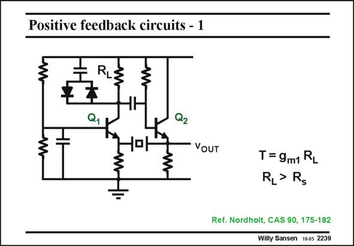

# SANSEN-2239 · Positive feedback circuits - 1

章节：22 晶体振荡器设计  
PDF 页：686；书本页：697；幻灯片编号：2239  
状态：unreviewed



## 对应教材讲解

### PDF 686 · 书本 697

In bipolar technology, many more oscillators have been realized. They all use several transistors and they all aim at the realization of a negative resistance by means of positive feedback. In the circuit in this slide, transistor Q1 is a cascode, which provides voltage gain at its Collector. Transistor Q2 is just an emitter follower, which provides the current through the small series resistor R of the cryss tal. The loop gain is therefore g R . m1 L As soon as R is larger than R , the oscillation builds up. This is a good feature of this L s oscillator. The signal amplitude is limited by the two diodes across the load resistor R . L All three capacitors serve as (de)coupling capacitances. They are all large and present negligible impedances at the frequency of oscillation.

## 公式／性能结论候选摘录

以下为规则截取的原文，尚未逐项判读。

- PDF 686: In the circuit in this slide, transistor Q1 is a cascode, which provides voltage gain at its Collector.
- PDF 686: The loop gain is therefore g R . m1 L As soon as R is larger than R , the oscillation builds up.
- PDF 686: The signal amplitude is limited by the two diodes across the load resistor R .

## 曲线结论候选摘录

以下为规则截取的原文，尚未逐项判读。

（未由规则找到；不代表原页没有此类内容。）

## 原文条件与近似候选摘录

以下为规则截取的原文，尚未逐项判读。

（未由规则找到；不代表原页没有此类内容。）

## 幻灯片 OCR（未校正）

```text
Positive feedback circuits - 1
RL:
Q1
H
-0-
Q2
— VOUT
T = 9m1 RL
RI> Rg
Ref. Nordholt, CAS 90, 175-182
Willy Sansen 1005 2239
```

数学上下标、分数及正负号以原图为准。电路图已保留；未核对的连接不输出成可仿真 netlist。
