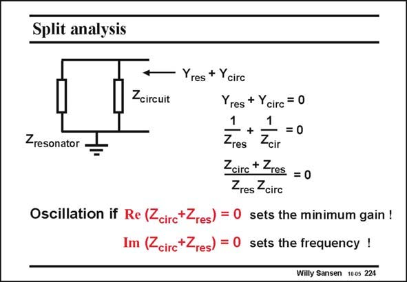

# SANSEN-224 · Split analysis

章节：22 晶体振荡器设计  
PDF 页：667；书本页：678；幻灯片编号：224  
状态：unreviewed



## 对应教材讲解

### PDF 667 · 书本 678

Another way to write the Barkhausen criterion is given by the split analysis. The amplifier is now represented by the impedance Z and the feedback elecircuit ment by the resonator impedance. As the circuit maintains oscillation by itself, no current is needed from outside. Its total input admittance is zero. The sum of the impedances must also be zero. The Barkhausen criterion can now be stated as given by the two expressions in this slide. Rather than the amplitude and phase, the Real and Imaginary parts are used now. They are obviously related as reminded in the Appendix. We will see later, that the first expression determines the minimum gain required, and the other the actual frequency of oscillation.

## 公式／性能结论候选摘录

以下为规则截取的原文，尚未逐项判读。

- PDF 667: We will see later, that the first expression determines the minimum gain required, and the other the actual frequency of oscillation.

## 曲线结论候选摘录

以下为规则截取的原文，尚未逐项判读。

- PDF 667: Rather than the amplitude and phase, the Real and Imaginary parts are used now.

## 原文条件与近似候选摘录

以下为规则截取的原文，尚未逐项判读。

（未由规则找到；不代表原页没有此类内容。）

## 幻灯片 OCR（未校正）

```text
Split analysis
Yres + Ycirc
Zcircuit
Yres + Ycirc = 0
1
1
+
-=0
Zresonator
Zres
Zcir
Zairc + Zres = 0
Zres -circ
Oscillation if Re (Zcirc+Zres) = 0 sets the minimum gain !
Im (<circ+Zres) = 0
sets the frequency !
Willy Sansen 1005 224
```

数学上下标、分数及正负号以原图为准。电路图已保留；未核对的连接不输出成可仿真 netlist。
