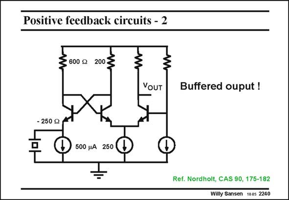

# SANSEN-2240 · Positive feedback circuits - 2

章节：22 晶体振荡器设计  
PDF 页：686；书本页：697；幻灯片编号：2240  
状态：unreviewed



## 对应教材讲解

### PDF 686 · 书本 697

Another bipolar crystal oscillator is shown in this slide. It is again a single-pin oscillator. The positive feedback is easily recognizable. Indeed, a cross-coupled transistor pair presents a negative resistance of −2/g (see Chapter 2). This m resistance now compensates the series resistance of the crystal. The output is nicely buffered from the oscillation circuit itself, by means of a cascode. The biasing is fixed. The amplitude is limited by the Base-Emitter diodes of the cross-coupled transistor pair.

## 公式／性能结论候选摘录

以下为规则截取的原文，尚未逐项判读。

- PDF 686: The amplitude is limited by the Base-Emitter diodes of the cross-coupled transistor pair.

## 曲线结论候选摘录

以下为规则截取的原文，尚未逐项判读。

（未由规则找到；不代表原页没有此类内容。）

## 原文条件与近似候选摘录

以下为规则截取的原文，尚未逐项判读。

（未由规则找到；不代表原页没有此类内容。）

## 幻灯片 OCR（未校正）

```text
Positive feedback circuits - 2
3 600 g
200
YOUT
Buffered ouput !
- 250 g
500 jA 250
Ref. Nordholt, CAS 90, 175-182
Willy Sansen 1005 2240
```

数学上下标、分数及正负号以原图为准。电路图已保留；未核对的连接不输出成可仿真 netlist。
