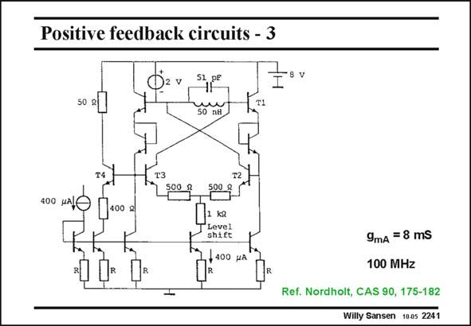

# SANSEN-2241 · Positive feedback circuits - 3

章节：22 晶体振荡器设计  
PDF 页：687；书本页：698；幻灯片编号：2241  
状态：unreviewed



## 对应教材讲解

### PDF 686 · 书本 697

Cross-coupling is used again in this high-frequency oscillator. This is a high frequency as the bipolar transistors have an f of only about 400 MHz. T The crystal is replaced by a parallel LC tank. The oscillation frequency is now close to the

### PDF 687 · 书本 698

parallel resonance frequency of this tank. Cross-coupling is used to generate a negative impedance to compensate the parallel resistance across the tank. Emitter followers and diodes are used to increase the output swing. This signal amplitude is also increased by insertion of emitter resistances of 500 V. Their g R factor is about m E 4. This is the answer of a bipolar transistor to the increase of the V −V in GS T a MOST. The biasing of the input devices is fixed. A safety margin must now be expected.

## 公式／性能结论候选摘录

以下为规则截取的原文，尚未逐项判读。

- PDF 687: Emitter followers and diodes are used to increase the output swing.
- PDF 687: This signal amplitude is also increased by insertion of emitter resistances of 500 V.
- PDF 687: This is the answer of a bipolar transistor to the increase of the V −V in GS T a MOST.

## 曲线结论候选摘录

以下为规则截取的原文，尚未逐项判读。

（未由规则找到；不代表原页没有此类内容。）

## 原文条件与近似候选摘录

以下为规则截取的原文，尚未逐项判读。

（未由规则找到；不代表原页没有此类内容。）

## 幻灯片 OCR（未校正）

```text
Positive feedback circuits - 3
50 gl
5} p°
SonH
8 v
400 UAI
400 gl
evey
shift
400 рA
9mA = 8 mS
100 MHz
Ref. Nordholt, CAS 90, 175-182
Willy Sansen 1005 2241
```

数学上下标、分数及正负号以原图为准。电路图已保留；未核对的连接不输出成可仿真 netlist。
