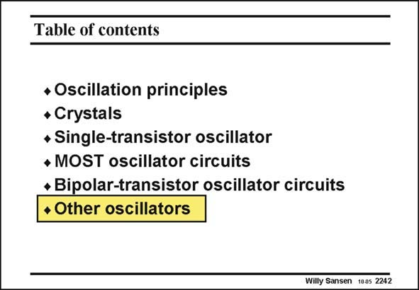

# SANSEN-2242 · Table of contents

章节：22 晶体振荡器设计  
PDF 页：687；书本页：698；幻灯片编号：2242  
状态：unreviewed



## 对应教材讲解

### PDF 687 · 书本 698

Finally, some more oscillators are added. They are not necessarily crystal oscillators but other types. Moreover, there are quite often many more transistors. They have been added to show that the principles discussed before, are still very much applicable.

## 公式／性能结论候选摘录

以下为规则截取的原文，尚未逐项判读。

（未由规则找到；不代表原页没有此类内容。）

## 曲线结论候选摘录

以下为规则截取的原文，尚未逐项判读。

（未由规则找到；不代表原页没有此类内容。）

## 原文条件与近似候选摘录

以下为规则截取的原文，尚未逐项判读。

（未由规则找到；不代表原页没有此类内容。）

## 幻灯片 OCR（未校正）

```text
Table of contents
• Oscillation principles
• Crystals
• Single-transistor oscillator
• MOST oscillator circuits
• Bipolar-transistor oscillator circuits
• Other oscillators
Willy Sansen 1005 2242
```

数学上下标、分数及正负号以原图为准。电路图已保留；未核对的连接不输出成可仿真 netlist。
