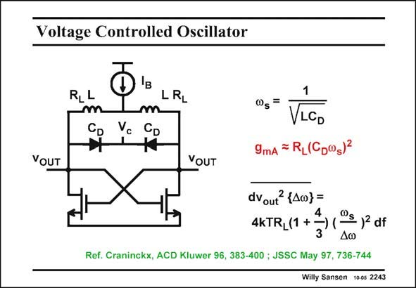

# SANSEN-2243 · Voltage Controlled Oscillator

章节：22 晶体振荡器设计  
PDF 页：688；书本页：699；幻灯片编号：2243  
状态：unreviewed



## 对应教材讲解

### PDF 687 · 书本 698

This oscillator again uses an LC tank to set the oscillation frequency. The inductors are planar spiral inductors. The capacitances are diode capacitances. They can therefore be tuned by changing control voltage V . This is why they are called VCO’s. The tuning range must be large c enough to compensate for the variations on the inductor (20%). For example, an inductor with about three windings, and with a hollow layout, is about 10 mm long. Its inductance is about 10 nH. With a diode capacitance of 1 pF, the oscillation frequency is about 1.6 GHz. Also, the minimum g is about 1 mS for a coil resistance R of 10 V (Q= mA L 10). For a V −V of 0.5 V, this would require a transistor current of 0.25 mA. GS T

### PDF 688 · 书本 699

It is obvious that the GHz range is easily achieved. However, to go lower or higher in frequency is a problem. One of the most important specifications of such a VCO is the phase noise. This is mainly the thermal noise of the transistors and coil series resistors R , con- L verted to sidebands of the oscillation frequency. Since this resistor R is linked to L the transconductance g , it mA is the main parameter in the expression of the phase noise. Actually, the term 4/3 is due to the transistor g . m A rule of thumb for phase noise is −100 dBc/Hz at 100 kHz distance from the carrier. In this example it is about −120 dBc/Hz at 100 kHz.

## 公式／性能结论候选摘录

以下为规则截取的原文，尚未逐项判读。

- PDF 687: They can therefore be tuned by changing control voltage V .

## 曲线结论候选摘录

以下为规则截取的原文，尚未逐项判读。

- PDF 688: One of the most important specifications of such a VCO is the phase noise.
- PDF 688: Since this resistor R is linked to L the transconductance g , it mA is the main parameter in the expression of the phase noise.
- PDF 688: Actually, the term 4/3 is due to the transistor g . m A rule of thumb for phase noise is −100 dBc/Hz at 100 kHz distance from the carrier.

## 原文条件与近似候选摘录

以下为规则截取的原文，尚未逐项判读。

（未由规则找到；不代表原页没有此类内容。）

## 幻灯片 OCR（未校正）

```text
Voltage Controlled Oscillator
YOUT
RLL
m
CD
LRL
m
Vc
CD
YOUT
@s
=
VLGD
9mA = R,(Cp®s)*
dvout {40}=
4kTR_(1 +→) (-
Os 12 df
Ref. Craninckx, ACD Kluwer 96, 383-400 ; JSSC May 97, 736-744
Willy Sansen 100s 2243
```

数学上下标、分数及正负号以原图为准。电路图已保留；未核对的连接不输出成可仿真 netlist。
