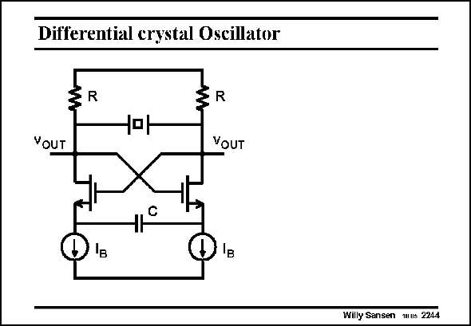

# SANSEN-2244 · Differential crystal Oscillator

章节：22 晶体振荡器设计  
PDF 页：688；书本页：699；幻灯片编号：2244  
状态：unreviewed



## 对应教材讲解

### PDF 688 · 书本 699

A differential version of the single-transistor Pierce oscillator is shown in this slide. For low frequencies, the impedance of the capacitor C is too large and no oscillation can build up. At high frequencies, it acts as a short and a negative impedance is presented to the crystal. The resistors have to be sufficiently high not to dampen the oscillation. They are better when replaced by current sources. The current setting sources I are better driven by an AGC loop, which measures the output B voltages. If not, the currents may be set too high, resulting in larger deviations in frequency or distortion.

## 公式／性能结论候选摘录

以下为规则截取的原文，尚未逐项判读。

（未由规则找到；不代表原页没有此类内容。）

## 曲线结论候选摘录

以下为规则截取的原文，尚未逐项判读。

（未由规则找到；不代表原页没有此类内容。）

## 原文条件与近似候选摘录

以下为规则截取的原文，尚未逐项判读。

（未由规则找到；不代表原页没有此类内容。）

## 幻灯片 OCR（未校正）

```text
Differential crystal Oscillator
YouT
R
VOUT
Willy Sansen mus 2214
```

数学上下标、分数及正负号以原图为准。电路图已保留；未核对的连接不输出成可仿真 netlist。
