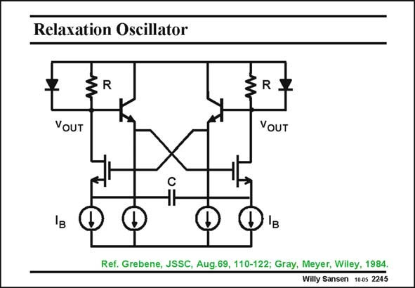

# SANSEN-2245 · Relaxation Oscillator

章节：22 晶体振荡器设计  
PDF 页：689；书本页：700；幻灯片编号：2245  
状态：unreviewed



## 对应教材讲解

### PDF 688 · 书本 699

Leaving out the crystal yields a relaxation oscillator. The frequency is now set by the currents I , capacitor C and the limiting voltage, which is here a V of a bipolar transistor. Actually, it B BE is I /(4CV ). Square waveforms are obtained at the outputs but a triangular one across the B BE time setting capacitor C.

### PDF 689 · 书本 700

Needless to say that this frequency is not all that accurate and very temperature dependent. Many such relaxation oscillators have been built and published. This is one of the earlier ones. Its main advantage is its tunability by means of current I . This range is limited B however by the base currents of the emitter follower transistors. Substituting them by MOST source followers allows a current and hence a frequency range of over 8 decades!

## 公式／性能结论候选摘录

以下为规则截取的原文，尚未逐项判读。

- PDF 688: The frequency is now set by the currents I , capacitor C and the limiting voltage, which is here a V of a bipolar transistor.
- PDF 689: Needless to say that this frequency is not all that accurate and very temperature dependent.
- PDF 689: This range is limited B however by the base currents of the emitter follower transistors.

## 曲线结论候选摘录

以下为规则截取的原文，尚未逐项判读。

（未由规则找到；不代表原页没有此类内容。）

## 原文条件与近似候选摘录

以下为规则截取的原文，尚未逐项判读。

（未由规则找到；不代表原页没有此类内容。）

## 幻灯片 OCR（未校正）

```text
Relaxation Oscillator
R
YOUT
VOUT
'в
Ref. Grebene, JSSC, Aug.69, 110-122; Gray, Meyer, Wiley, 1984.
Willy Sansen 10.05 2245
```

数学上下标、分数及正负号以原图为准。电路图已保留；未核对的连接不输出成可仿真 netlist。
