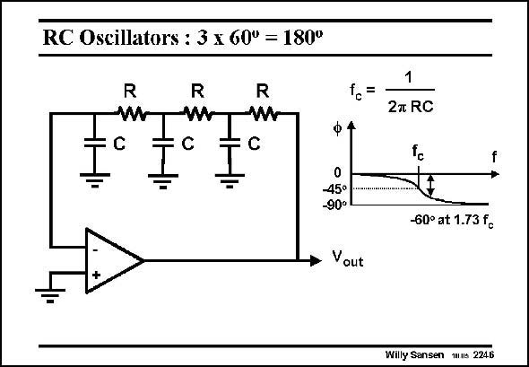

# SANSEN-2246 · RC Oscillators : 3 x 60° = 180°

章节：22 晶体振荡器设计  
PDF 页：689；书本页：700；幻灯片编号：2246  
状态：unreviewed



## 对应教材讲解

### PDF 689 · 书本 700

A low-frequency oscillator is easily built by means of an opamp. An example is given in this slide. Without capacitors we would have negative feedback and no oscillation. However, at the frequency f , sufficient phase shift is c taken up by the RC circuit to turn the negative feedback into positive feedback. Barkhausen is satisfied provided there is sufficient gain around the loop at this frequency. The oscillation then builds up with a frequency of about 1.7f . c No amplitude limitation is shown. Two diodes could be added at the output to limit the output swing.

## 公式／性能结论候选摘录

以下为规则截取的原文，尚未逐项判读。

- PDF 689: Barkhausen is satisfied provided there is sufficient gain around the loop at this frequency.
- PDF 689: The oscillation then builds up with a frequency of about 1.7f . c No amplitude limitation is shown.
- PDF 689: Two diodes could be added at the output to limit the output swing.

## 曲线结论候选摘录

以下为规则截取的原文，尚未逐项判读。

- PDF 689: However, at the frequency f , sufficient phase shift is c taken up by the RC circuit to turn the negative feedback into positive feedback.

## 原文条件与近似候选摘录

以下为规则截取的原文，尚未逐项判读。

- PDF 689: Barkhausen is satisfied provided there is sufficient gain around the loop at this frequency.

## 幻灯片 OCR（未校正）

```text
RC Oscillators : 3 x 60° = 180°
R
wW
R
W
R
W
C
1
2T RC
ф 4
0
45°
-90°
• Vout
:
-60° at 1.73 fo
Willy Sansen us 2246
```

数学上下标、分数及正负号以原图为准。电路图已保留；未核对的连接不输出成可仿真 netlist。
