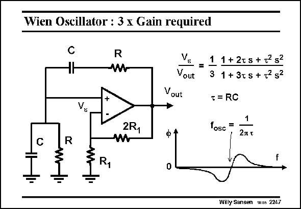

# SANSEN-2247 · Wien Oscillator : 3 ≤ Gain required

章节：22 晶体振荡器设计  
PDF 页：690；书本页：701；幻灯片编号：2247  
状态：unreviewed



## 对应教材讲解

### PDF 689 · 书本 700

A well-known oscillator with an opamp is the Wien bridge oscillator, shown in this slide. It consists of an opamp with a series and a parallel RC circuit around the feedback loop. Two more resistors 3R and R ensure a voltage gain of about 3. 1 1

### PDF 690 · 书本 701

From the expression of the loop gain, it is clear that this circuit will oscillate at the frequency f . The attenosc uation of 1/3 is compensated by the voltage gain of 3. Moreover, the phase shift around the loop is zero at this frequency. Again no amplitude limitation is added. Two diodes could again be added at the output to limit the output swing.

## 公式／性能结论候选摘录

以下为规则截取的原文，尚未逐项判读。

- PDF 689: Two more resistors 3R and R ensure a voltage gain of about 3. 1 1
- PDF 690: From the expression of the loop gain, it is clear that this circuit will oscillate at the frequency f .
- PDF 690: The attenosc uation of 1/3 is compensated by the voltage gain of 3.
- PDF 690: Again no amplitude limitation is added.
- PDF 690: Two diodes could again be added at the output to limit the output swing.

## 曲线结论候选摘录

以下为规则截取的原文，尚未逐项判读。

- PDF 690: Moreover, the phase shift around the loop is zero at this frequency.

## 原文条件与近似候选摘录

以下为规则截取的原文，尚未逐项判读。

（未由规则找到；不代表原页没有此类内容。）

## 幻灯片 OCR（未校正）

```text
Wien Oscillator : 3 ≤ Gain required
C
R
R
2R,
=
1 1+2ts +72 s2
Vout
3 1 + 3t5+2252
Vout
T = RC
fosc
=
ф +
2л x
Willy Sansen wus 2247
```

数学上下标、分数及正负号以原图为准。电路图已保留；未核对的连接不输出成可仿真 netlist。
