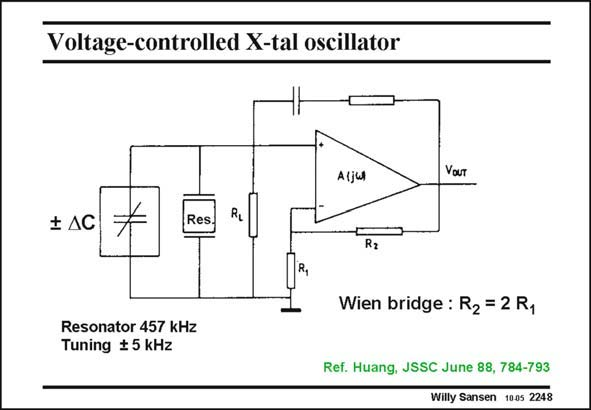

# SANSEN-2248 · Voltage-controlled X-tal oscillator

章节：22 晶体振荡器设计  
PDF 页：690；书本页：701；幻灯片编号：2248  
状态：unreviewed



## 对应教材讲解

### PDF 690 · 书本 701

The same Wien bridge oscillator can be used to build a Voltage Controlled Crystal oscillator. Obviously, this is a contradiction. Normally, a crystal oscillator is used to fix the frequency with high accuracy. A VCO on the other hand is used to vary the frequency over 20–30%. However, sometimes, especially for timing purposes, we want to set the crystal frequency to an accurate value which is slightly different from the crystal frequency itself. In this example, a resonator is used, which is similar to a crystal but with a lower Q factor, to set the frequency at exactly 460,00 kHz. The resonator has only 457 kHz. How do we solve this problem? The resonator is part of the Wien bridge. The solution is therefore to add a parallel capacitance to the resonator to detune it. The oscillation will obviously take place much closer to parallel resonance than to series resonance. Changing the parallel capacitance is now an easy way to slightly change the oscillation frequency. In order to be able to tune the frequency in both directions, we have to be able to add a capacitance DC, which can be both positive and negative. Moreover, we want to be able to control this capacitance value with a voltage or current.

## 公式／性能结论候选摘录

以下为规则截取的原文，尚未逐项判读。

- PDF 690: The solution is therefore to add a parallel capacitance to the resonator to detune it.

## 曲线结论候选摘录

以下为规则截取的原文，尚未逐项判读。

（未由规则找到；不代表原页没有此类内容。）

## 原文条件与近似候选摘录

以下为规则截取的原文，尚未逐项判读。

（未由规则找到；不代表原页没有此类内容。）

## 幻灯片 OCR（未校正）

```text
Voltage-controlled X-tal oscillator
Aljul
Your
‡AC
Res
R2
R,
Wien bridge : R2 = 2 R1
Resonator 457 kHz
Tuning $ 5 kHz
Ref. Huang, JSSC June 88, 784-793
Willy Sansen 10.05 2248
```

数学上下标、分数及正负号以原图为准。电路图已保留；未核对的连接不输出成可仿真 netlist。
