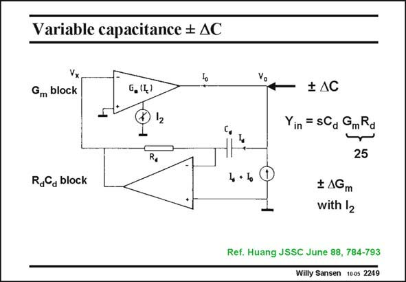

# SANSEN-2249 · Variable capacitance # AC

章节：22 晶体振荡器设计  
PDF 页：691；书本页：702；幻灯片编号：2249  
状态：unreviewed



## 对应教材讲解

### PDF 691 · 书本 702

How to realize a capacitance that can be varied by means of a voltage or current? The Miller effect could be used. An alternative is the circuit in this slide. A differentiator with components R and C is inserted in a d d feedback loop with a variable G block. The input m admittance is easily calculated. It is capacitance C , d multiplied by G R . This m d factor is about 25 in this example. With 4 pF for C , d this allows a capacitance change DC of about 100 pF. If G can now be made positive and negative, then we have a capacitance which is positive m and negative. Current I will be used to control the transconductance G from positive, through zero to 2 m negative values.

## 公式／性能结论候选摘录

以下为规则截取的原文，尚未逐项判读。

（未由规则找到；不代表原页没有此类内容。）

## 曲线结论候选摘录

以下为规则截取的原文，尚未逐项判读。

（未由规则找到；不代表原页没有此类内容。）

## 原文条件与近似候选摘录

以下为规则截取的原文，尚未逐项判读。

（未由规则找到；不代表原页没有此类内容。）

## 幻灯片 OCR（未校正）

```text
Variable capacitance # AC
Gm block
G, (4)
12
R,
‡ AC
Yin = SCa GmRd
25
RdCa block
4 + 1
‡ AGm
with |2
Ref. Huang JSSC June 88, 784-793
Willy Sansen 1005 2249
```

数学上下标、分数及正负号以原图为准。电路图已保留；未核对的连接不输出成可仿真 netlist。
