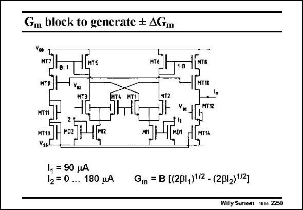

# SANSEN-2250 · Gu block to gencrate AGm

章节：22 晶体振荡器设计  
PDF 页：691；书本页：702；幻灯片编号：2250  
状态：unreviewed



## 对应教材讲解

### PDF 691 · 书本 702

To realize a transconductance G from positive to m negative values, a symmetrical opamp is used, in which the input stage is doubled. Moreover, the two input stages are cross-coupled. When both input pairs have the same biasing current, nothing can come out. The output currents cancel perfectly. If one current, for example current I through 1 MI1, is larger than I 2 through MI2, then the differential pair MT1/MT2 provides a larger output current I , which flows into the circuit. o If, on the other hand, current I is larger than I , than the output current changes polarity. 2 1 As a consequence we can obtain positive and negative output currents by allowing changes to I with respect to I , as indicated in this slide. 2 1

## 公式／性能结论候选摘录

以下为规则截取的原文，尚未逐项判读。

（未由规则找到；不代表原页没有此类内容。）

## 曲线结论候选摘录

以下为规则截取的原文，尚未逐项判读。

（未由规则找到；不代表原页没有此类内容。）

## 原文条件与近似候选摘录

以下为规则截取的原文，尚未逐项判读。

（未由规则找到；不代表原页没有此类内容。）

## 幻灯片 OCR（未校正）

```text
Gu block to gencrate AGm
MTS
MT6
1:8
MT®
HT1D
1T2
MTTZ
MT11
MТ13
MD2
MIZ
•| MT14
1, = 90 нA
12=0 ... 180 pA
Gm = B [(2ß1,)1/2 - (2ß1-)12]
Willy Sansen wus 225D
```

数学上下标、分数及正负号以原图为准。电路图已保留；未核对的连接不输出成可仿真 netlist。
