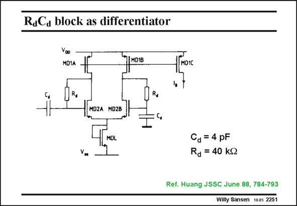

# SANSEN-2251 · RdCa block as differentiator

章节：22 晶体振荡器设计  
PDF 页：692；书本页：703；幻灯片编号：2251  
状态：unreviewed



## 对应教材讲解

### PDF 692 · 书本 703

The differentiator is made differential. It is little more than a pseudo-differential pair, to which the resistor R and capacitor C are d d applied. With the values of R and C as given, a time d d constant is reached of about 160 ns, which is less than the oscillation period of 348 ns. The time constants in the opamp itself are not negligible however, and the picture is slightly more complicated.

## 公式／性能结论候选摘录

以下为规则截取的原文，尚未逐项判读。

（未由规则找到；不代表原页没有此类内容。）

## 曲线结论候选摘录

以下为规则截取的原文，尚未逐项判读。

（未由规则找到；不代表原页没有此类内容。）

## 原文条件与近似候选摘录

以下为规则截取的原文，尚未逐项判读。

（未由规则找到；不代表原页没有此类内容。）

## 幻灯片 OCR（未校正）

```text
RdCa block as differentiator
Yao
MDIA
1IMONS
Гмоrс
Re
MOZA MD28
Cd = 4 pF
Rd = 40 kg
Ref. Huang JSSC June 88, 784-793
Willy Sansen 1005 2251
```

数学上下标、分数及正负号以原图为准。电路图已保留；未核对的连接不输出成可仿真 netlist。
